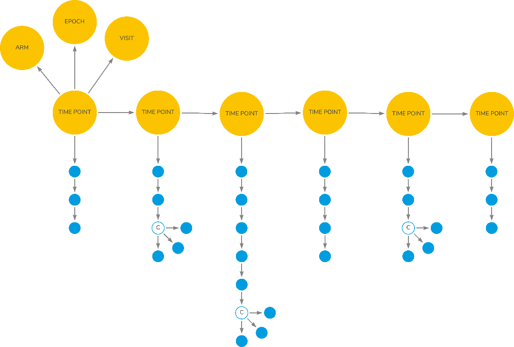
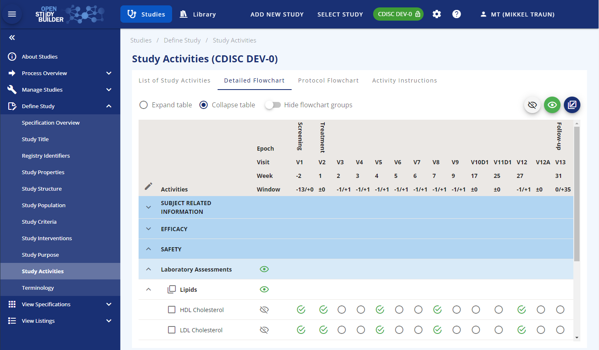
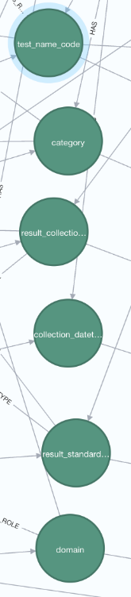
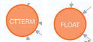
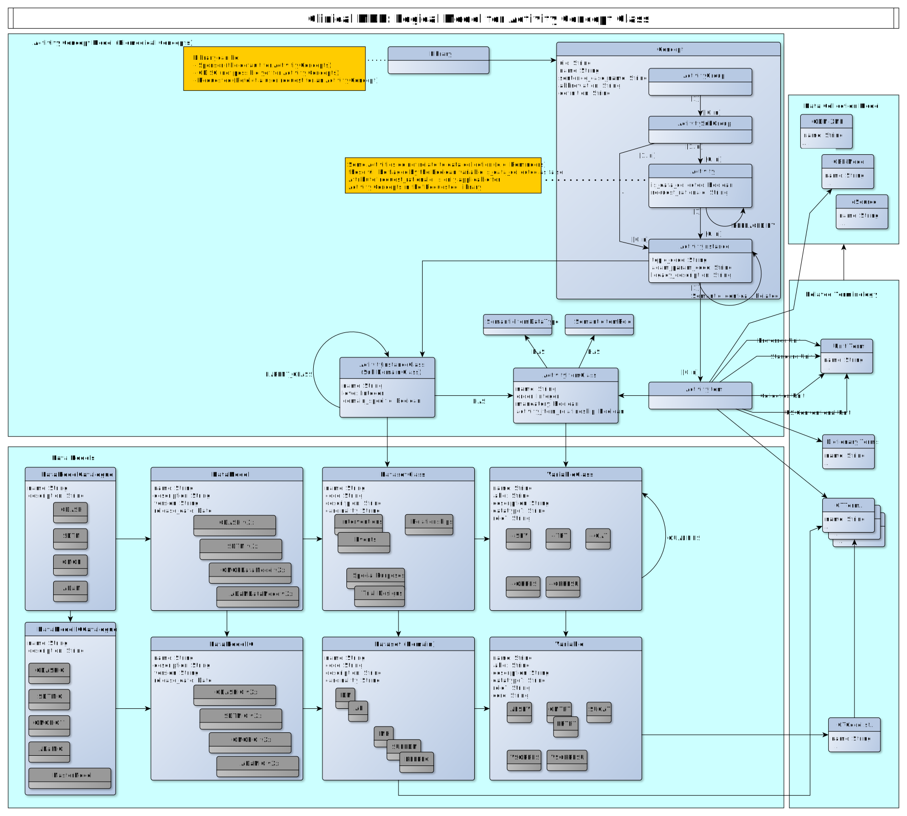
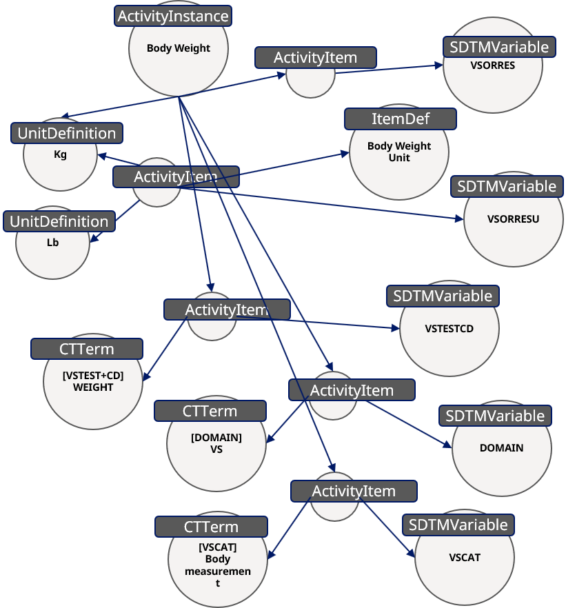

# Biomedical Concepts & OSB Activity Concept {: class="guideH1"}

(created 2023-02-17) 
{: class="guideCreated"}

In the library part of the OpenStudyBuilder various kinds of concept definitions are available:


{: class="imageParagraph"}

Figure 1: The OpenStudyBuilder Library Part
{: class="imageDescription"}
 
These standard concepts are used when specifying study metadata which allows a high degree of reusability and conformance checks. This article focusses on the "Activities" (Activity Concepts) which are like Biomedical Concepts (BCs).

First, we will give a brief overview of what a Biomedical Concept is and how OpenStudyBuilder Activity Concepts fit into the definition. Then we will focus on describing the use of the Activity Concepts in a study definition. Finally, we will share the conceptual model used for the Activity Concepts in the OpenStudyBuilder.

## Biomedical Concept (BC)

### Definition

One definition is provided by Sam Hume (CDISC)^[1]^:

> BCs address metadata gaps in the current CDISC standards. They provide the conceptual definitions supporting the existing CDISC Foundational Standards metadata. This conceptual metadata is necessary to generate operationally ready Data Elements (DE). These operational DEs represent the detail needed to create the dataset variable, and to get definitions and value level metadata needed to generate a Define-XML document.<br/><br/>A BC is a unit of knowledge created by a unique combination of characteristics. As noted above, BCs complement the existing standards, but omit the operationalization of the standards. That is, BCs exist independent of any given standards implementation, such as SDTMIG v3.2 or CDASHIG v2.0. A BC specifies an observation concept, or what should be observed for a specific subject assessment in a clinical study, but not how to capture the data or how to group observations together

Another definition has been provided by Dave Iberson-Hurst (data4knowledge)^[2]^:

> A Biomedical Concept is the recording, in data, of a single activity within a clinical study.

Armando Olivia provides the following definition  using the term Activities^[3]^:

> Study Activities may be observations, assessments, or administrative activities (informed consent, randomization).<br/><br/>Study Activity, defined as any activity associated with the planning, conduct, analysis, and interpretation of a study. We recognize different sub-types, such as study design activities (Arms, Epochs, Visits, etc.), administrative activities (informed consent, randomization), intervention activities (clinical observations, therapeutic interventions), analysis activities. One highly important type of study activity is Assessments, and they need to be added to the model.

This then requires a definition of an Activity within a clinical study, here we can use the definition from the CDISC Glossary^[4]^:

> An action, undertaking, or event, which is anticipated to be performed or observed, or was performed or observed, according to the study protocol during the execution of the study. 

In the OpenStudyBuillder, the activity concept is defined closer to the definition by Armando Olivia and broader than the above definitions by Sam Hume and Dave Iberson-Hurst. An activity concept in OpenStudyBuillder is made to support both the protocol specification (electronically) as well as the down-stream data flow (Forms, SDTM). An activity in the OpenStudyBuillder can be a clinical recording (like the definition by Dave Iberson-Hurst), but it can also be an activity performed during the study that is not leading to collection of data, for example the administration of study drug (like definition by Armando Olivia).

!!! tip  

    To get a detailed understanding of Biomedical Concepts, we recommend checking the [reference](guide_activity_concept.md#references) links one to three.

### Example

To get a better understanding of what a biomedical concept is, let's look at an example. We observe a clinical recording as:

```
Subject 101 had a weight of 76 kg on 01 JAN 2020 which is study day 1.
```

This information belongs to Vital Signs. The Vital Signs test (VS test code) is "WEIGHT" and the result is "76" with the needed unit "kg". In addition, we have the timing information with the date and a reference to the study starting day.

This full set of metadata constitute a Biomedical Concept.


{: class="imageParagraph"}

Figure 2: Biomedical Concept for Information
{: class="imageDescription"}

Or represented in a tabular format:

Item | property | value |type
-- | -- | -- | --
BC | identifier | Weight | Identifier
Topic | TEST | Weight | TOPIC
Result | value | 76 | Result Qualifier
Unit | value | kg | Variable Qualifier
Data of Collection | collection_date |  01 JAN 2020 | Timing

The value 76 is meaningful when it is defined in a Biomedical Concept together with its qualifiers. In the following we will use the term "a logical observation" for the above combined elements of information.  

### Definition Activity Concept

In OpenStudyBuilder we use the term ActivityConcept for the implementation of a Biomedical Concept with the following definition ([see also section: High-level Logical Activity Concepts Model](guide_activity_concept.md#high-level-logical-activity-concepts-model)):

> We differentiate between two different types of activity concepts: a sematic logical observation and a semantic specific activity. If the activity is related to data collection, then the activity corresponds to a logical data observation; otherwise, it’s a semantic specific activity. 

> The activity related to a logical data observation is defined at a level of granularity where it will match an observation: an example can be Systolic blood pressure measured sitting, in unit of mmHg, at a specific point in time. 

> The semantic specific activity not related to data collection can e.g., be dosing instructions for the subject. 

## Usage of Activity Concepts

The OpenStudyBuilder has functionality to create an electronic "protocol". As a user you can define the study design, the visits and what is to be performed/collected at each visit (called Flowchart in OpenStudyBuilder, others may call it Schedule of Activities (SoA)). The Activity Concepts are the activities in the protocol flowchart (or SoA).

On a high-level, a study flowchart can be illustrated as in Figure 3. At a series of timepoint (within an arm, epoch and visit) as set of planned activities is scheduled to occur (the blue dots). Each of the blue dots, when expanding them (illustrated by the 'c'-dot) will have further details as we saw in weight the example above (result, unit).  
 

{: class="imageParagraph"}

Figure 3: Study Flowchart for Scheduled Activities
{: class="imageDescription"}

(Source: &#169; Dave Iberson-Hurst, Biomedical Concepts, A Treatise, 18-May-2022, version 0.3)
{: class="imageDescription"}

At protocol level the details of unit and other qualifiers are not needed, but it is important for the down-stream data processing like CRF and SDTM creation. At protocol level we will just display and refer to the identifier of the Activity Concepts.

### Define Activities for a Study

In the OpenStudyBuilder the Activity Concepts can be accessed via the Study Activities in the left menu. The first tab shows the list of activities. You can add the activities or collections to be performed on this view.


{: class="imageParagraph"}

Figure 4: Screenshot of Study Activities in OpenStudyBuilder
{: class="imageDescription"}
 
There are three different levels for activity concepts the user can select from: Activity Group, Activity Subgroup and Activity. In a later version it will also be possible to select on the Activity Instance level which is more detailed level. For example, an Activity=Glucose, you can have more detailed version depending on specimen (Activity Instance = Glucose Urine, Activity Instance = Glucose Serum, Activity Instance = Glucose Plasma). They are all grouped in/linked to the same Activity: Activity=Glucose.

Also, later version will allow for study level configurations such as disable parts of the activity definition that is not needed for a particular study (for example leaving out a unit that is not used or a whole qualifier, e.g., position if that is not important for the blood pressure measurement).

On the "Detailed Flowchart" tab, you can control what level of activity to be displayed in the protocol schedule of activities as well as when collections are to be scheduled.


{: class="imageParagraph"}

Figure 5: Manage Study Activities Display in OpenStudyBuilder
{: class="imageDescription"}

### Visualize Activities (Protocol Flowchart)

On the "Protocol Flowcharts" tab, you can preview how the schedule of activities will be displayed in the protocol. When an activity concept is selected in the schedule of activities in a study it is possible to either select the exact activity instance if all details are known or just the activity itself if some details are still unclear (unit, specimen etc). Once the details of the activity have been clarified it will be possible to select the activity instance. The activity will often be the level of detail needed for the protocol schedule of activities. 
 

{: class="imageParagraph"}

Figure 6: Protocol Flowchart Display
{: class="imageDescription"}

## Activity Concepts Data Model

Let us now focus on the model behind the activity concepts. The activity concepts subject area covers the biomedical concepts related to study procedures and assessments. An activity concept can be defined at four different levels each being of the general concept's type within the OpenStudyBuilder. These have relationships to the activity class model, controlled terminologies and dictionary terms as well as to data collection structures.

An example of an activity concept and its relationship is given in Figure 7.

[](./img/guide_ac_07.png)
{: class="imageParagraph"}

Figure 7: Example of Activity Concept - Weight and its relationships as per Activity Concept Model
{: class="imageDescription"}

### High-level Logical Activity Concepts Model

The entities within the Activity Concepts Model are illustrated in the following diagram.

[](./img/guide_ac_lmhlac.svg)
{: class="imageParagraph"}

Figure 8: High Level Activity Concept Model Diagram
{: class="imageDescription"}

The entities within the Activity Concepts Model are described in the following table.

Entity | Definition | Example
-- | -- | --
Library | Entity holds the name and definition of the library that are the source and owner for the related element. | CDISC Library, Sponsor Library, User Requested
Concept | Within the Activity Concept subject area, the entities of the Concept type are: <br/><ul><li>Activity Group</li><li>Activity Subgroup</li><li>Activity</li><li>Activity Instance</li></ul><br/>All these share a set of attributes and will have a relationship to the library they belong to. | See the concept subtypes in Figure 9. 
Activity Group | High level grouping of study activities (procedures and assessments) as the clinical term relevant for representation in the protocol.<br/>This can be what you decide to show in the protocol schedule of activities, it may be like a data collection instrument or other relevant grouping. By default, there is a General Group. | General, Laboratory Assessments, Clinical Outcome Assessments. <br/>"Exammination" as in figure 7: 
Activity Subgroup | Medium level grouping of study activities (procedures and assessments) as the clinical term relevant for representation in the protocol.<br/>This can be what you decide to show in the protocol schedule of activities, it may be like CRF form names, questionnaire or clinical procedures.<br/>The Activity Subgroup will always have a relationship to one Activity Group. | Vital signs, Lipids, SF36 V2.0 Standard, Adverse Event<br/>"Body Measurements" as in figure 7: 
Activity | *DDF definition:* An action, undertaking, or event, which is anticipated to be performed or observed, or was performed or observed, according to the study protocol during the execution of the study.<br/>*OpenStudyBuilder:* If relating to data collection, the activity at a level resulting in a semantic logical observation, this can be depending on context and qualifiers having different identifications. If not related to data collection, then to a semantic specific activity.<br/>The Activity can be related to one or more Activity Subgroups. | Body weight, Systolic blood pressure, HDL Cholesterol, SF-36 v2.0 Standard<br/>"Body Weigth" as in figure 7: 
Activity Instance | *OpenStudyBuilder:* The specific identification of the logical observation, this includes reference to context and qualifier values. For example, this includes references to ADaM BDS PARAM/PARAMCD or column name in ADSL, it also include internal unique identification as well as internal topic code.This will enable unique identification of source data, representation in SDTM by several qualifiers, and representation in ADaM BDS by PARAMCD value.<br/>The Activity Instance will always have a relationship to one Activity. The Activity Instance can have relationship to one or more Activity Instance Class's. | Body Weight, Fasting Plasma Glucose, HDL Cholesterol Plasma <br/>"Body Weight" as in figure 7: 
Activity Instance Class | This is the class of the logical observation giving the template of variables, the Activity Item Class's, relevant for an Activity Instance. For example, some variables are expected for a numeric finding, being collection unit, collection value, standard unit, value in standard unit. These are common characteristics of logical observations measuring numeric assessments.<br/>The Activity Instance Class have a recursive self-relationship describing the hierarchal relationship from general class's to more specific ones. The properties from the general ones are inherited to the sub classes. E.g., Subject Observation -> Finding -> Numeric Finding.<br/>The Activity Instance Class also have a relationship to zero or more Activity Item Class's. | Subject Observation, Finding, Numeric Finding,Categoric Finding<br/>"Finding" or "NumericFinding" as in figure 7:  
Activity Item Class | The semantic generic type of variable related to a specific Activity Instance Class. It will be related to a semantic variable role and a semantic data type.<br/>Most Activity Item Class's will be related to an Activity Instance via an Activity Item.<br/>The Activity Item Class will have relationship to the Variable Class representations in various Data Models and Implementation Guides.<br/>The Activity Item Class is a semantic definition of the variable related to an Activity Instance holding the relationship to the various representations in connected data models.<br/>The Activity Item Classes are typically defined out of general SDTM and ADaM model understanding but is independent of any specific data models.<br/>The Activity Item Class will always have a relationship to one Semantic Item Data Type and one Semantic Item Role. | collection_datetime, laterality, result_collection_unit,result_standard_unit<br/>"domain" or "test_name_code" or ... as in figure 7: <br/>
Semantic Item Data Type | The generic sematic variable item data type for an activity item class. This is independent of the data type in the various data model representations - but these are of course related and data type conversions can be defined. E.g., a datetime can be in multiple variables in CDASH, in a text-based ISO 8601 format in SDTM and in a numeric representation in ADaM. | TEXT, INTEGER, FLOAT, DATETIME, CTTERM <br/>"CTTERM" or "FLOAT" as in figure 7: <br/>
Semantic Item Role | The generic semantic role a variable item has for a logical observation. These are inspired by SDTM variable roles but independent of any specific data model representation. | IDENTIFIER, TOPIC, RECOQUAL, RESUQUAL. "TOPIC" or "IDENTIFIER" as in figure 7: <br/>
Activity Item | This carries the ternary relationship between a specific Activity Instance to Activity Item Class and Controlled Term.<br/>The Activity Item will always have a relationship to one Activity Instance and one Activity Item Class. It may have one or more relationships to CT or Dictionary Terms or other Concepts (like Unit Definitions).<br/>The Activity Item also carry the relationship to one or more data collection item(s). | Body Weight -> test_code_name -> WEIGHT in VSTESTCD<br/>Grey connecting dots as in figure 7: <br/>
 
### Logical Activity Concepts Entity Attribute Model

The following logical data model diagram illustrate the entity attributes and relationship to related subject areas.

[](./img/guide_ac_lm_acc.svg)
{: class="imageParagraph"}

Figure 9: Logical Modal for Activity Concept Class
{: class="imageDescription"}
 
The following table describe the main entity attributes:

Entity | Attribute | Definition | Example
-- | -- | -- | --
Concepts shared for ActivityGroup, ActivitySubGroup, Activity, ActivityInstance | uid | Unique identifier within the system database. These are used for internal reference and audit trail. Can be seen when viewing the history or audit trail. Typical a concatenation of the label name and a running integer. | Activity_000001
 | name | Default display name in title case. | Weight
 | sentence_case_name | Default name to be used in sentence generation, value by default in lower case, but abbreviations and term in correct case as expected in paragraph text. | weight, HbA1c.
 | abbreviation | Common short abbreviation when preferred name is long. | FPG, Hba1C.
 | definition | Semantic concept definition. | The hemoglobin A1c (HbA1c) test measures the amount of blood sugar (glucose) attached to your hemoglobin. Hemoglobin is the part of your red blood cells that carries oxygen from your lungs to the rest of your body. It is an important blood test that gives a good indication of how well your diabetes is being controlled.
Activity (additional attributes) | is_data_collected | Boolean indicator if this Activity is related to data collection or represent a reminder or procedure without expected data collection. | Yes, No.
 | request_rationale | Rationale for an Activity request, only applicable for Activity Placeholders requested by a study user. | I need this new assessment for my study.
Activity Instance | topic_code | Option to store the topic  | 
 | adam_param_code | Option to store the ADAM parameter code  | 

## Example Activity Concept

After we have explained the Activity concept (see [here](guide_activity_concept.md#high-level-logical-activity-concepts-model)), let us look at a concrete example concept for body weight in the OpenStudyBuilder which is visualized in Figure 10. We use an "ActivityGroup" called "Examiniations" with the "ActivitySubgroup" of "Body Measurements". The "Activity" as well as the "ActivityInstance" we name "Body Weight". 


{: class="imageParagraph"}

Figure 10: Body Weight Example Activity Concept
{: class="imageDescription"}

In the Study Flowchart we can use this grouping to group and display the corresponding activity. But furthermore, we can use the same information on the CRF by having a form definition "FormDef" and an item group definition "ItemGroupDef" which is linked to these activities. The "ActivityItem"s contain additional detailed information. For this the "Body Weight" can either use "kg" or "lb" as "UnitDefinition". Such information can be linked to item definitions "ItemDef" required for the CRF design and simply be used. For this the CRF can contain the unit selection as well as an examination date.
 

{: class="imageParagraph"}

Figure 11: Additional Information for Body Weight
{: class="imageDescription"}

Additionally, the concepts contain also the SDTM information - "Body Weight" belongs to the "SDTMVariable" which is "VSCAT" using the "CTTERM" "VSCAT = Body measurement". The same can be done to link the domain and other related information like the content for the SDTM variable "VSORRES".  

Just by adding links to ADAM, define-xml and any other information, you might be able to envision the automation capabilities of these concepts. Such concepts do not only support data collection, presentation, CDISC standards support, but could be used automate many our processes and beyond. The main disadvantage is the complexity of such concepts, as we still need to be able to work with this.

Luckily not everyone needs to understand these concepts. A study designer can still work without knowing the concept behind. With a corresponding implementation and usage behind a concept everyone will benefit from this. For example, a study designer can simply select activities like collection of body weight, height, pulse and more and the CRF designer will automatically see these items on the CRF, and the study analyst can see the SDTM variables which they can expect and much more. If the protocol is updated with a new "Actitvity", that could automatically be added as new CRF item and will be dedicated to SDTM variable(s) - if implemented that way. 


## OpenStudyBuilder Data Model

The concepts data model is documented in the OpenStudyBuilder public repository and can be browsed to gain a better understanding of these. You do find the data model diagrams under ["neo4j-mdr-db\model"](https://gitlab.com/Novo-Nordisk/nn-public/openstudybuilder/OpenStudyBuilder-Solution/-/tree/main/neo4j-mdr-db/model){target=_blank}. Note the solution is a MVP solution under development and the documentation is under updates as well. There might therefore be gaps in the diagrams, enhancements and updates to these data model diagrams. Development is ongoing and models will be updated as part of new releases. 

To manage the complexity of the domain, we distinguish between four abstraction layers from a data model perspective: 

- **Conceptual model** - how "manager"-level stakeholders view the data. (High-level) 
- **Domain model** - how end-users perceive the data, for "user"-level conversations. 
- **Logical model** - how the front-end developers and other data consumers perceive the data. 
- **Physical model** - how our API developers work with the data (as stored on disk in the database). 

The models are created using a yEd editor from yWorks, it is suggested to use this software to view the models (software available [here](https://www.yworks.com/products/yed){target=_blank} or live view [here](https://www.yworks.com/yed-live/){target=_blank}). 

The Logical Modal for Activity Concept Class is for example available via ["neo4j-mdr-db\model\logical_data_model\logical-model-activity-class-concept.graphml"](https://gitlab.com/Novo-Nordisk/nn-public/openstudybuilder/OpenStudyBuilder-Solution/-/blob/main/neo4j-mdr-db/model/logical_data_model/logical-model-activity-class-concept.graphml){target=_blank}. 

## References

- [1] CDISC 360: Using Biomedical Concept Metadata to Generate Case Report Forms and Dataset Definitions, PHUSE US Connect 2020, Paper TT06 by Sam Hume (CDISC), [https://www.lexjansen.com/phuse-us/2020/tt/TT06.pdf](https://www.lexjansen.com/phuse-us/2020/tt/TT06.pdf){target=_blank}, accessed on 06.02.2023

- [2] Biomedical Concepts - A Treatise by Dave Iberson-Hurst (data4knowledge), Draft 0.3, 18th May 2022, [https://github.com/data4knowledge/biomedical_concepts/blob/main/docs/bc treatise/Biomedical Concepts Treatise.pdf](https://github.com/data4knowledge/biomedical_concepts/blob/main/docs/bc treatise/Biomedical Concepts Treatise.pdf){target=_blank}, accessed on 06.02.2023

- [3] Thoughts on Medical Informatics, Blog by Armando Oliva, [https://aolivamd.blogspot.com/](https://aolivamd.blogspot.com/){target=_blank}, accessed on 10.02.2023

- [4] CDISC Protocol Controlled Terminology, CDISC CT "C71473" for "Study Activitiy" [https://evs.nci.nih.gov/ftp1/CDISC/Protocol/Archive/Protocol%20Terminology%202017-12-22.html](https://evs.nci.nih.gov/ftp1/CDISC/Protocol/Archive/Protocol%20Terminology%202017-12-22.html){target=_blank}, accessed on 10.02.2023