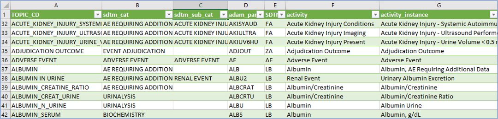
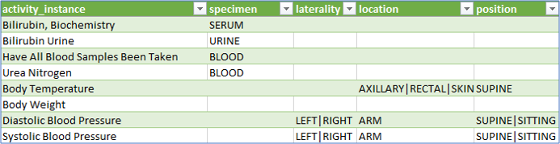
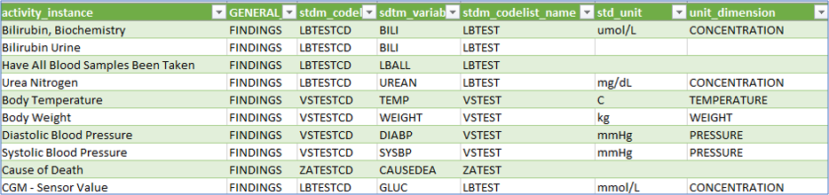

# Beyond concepts {: class="guideH1"}

(created 2025-03-05) 
{: class="guideCreated"}

The activity concepts, as explained in the corresponding [guide](./guide_activity_concept.md), extend beyond the definition used for the Schedule of Activities. These concepts are crucial for linking the necessary information to enable and trace the flow from defining an activity in the protocol, through a data specification that can then be used in a concrete data collection. This information will be placed in a specific location within the data model(s), e.g. SDTM, and can later be linked to analysis results.

This documentation delves into the details of the current linkage (comparable to Biomedical Concepts). It is related to the CDISC Biomedical Concepts, which are described [here](https://www.cdisc.org/cdisc-biomedical-concepts).

## Linking vision

The idea is to create and utilize a connecting flow - define once and use many times!

The core elements are to be linked together:

- Protocol definition
- CRF utilization
- EDC specification
- SDTM definition
- ADAM definition

The activities, which are for example any kind of laboratory tests, build the base for the linkage. The following example shows how it could be envisioned in general. 

{target=_blank}
{: class="imageParagraph"}

Figure 1: Linking All Together - High Level Vision
{: class="imageDescription"}

In the first place, there is an activity with a specific meaning, for example, "Bilirubin". This activity belongs to a group and subgroup - in this example, it is a "Laboratory Assessment" belonging to the "Urinalysis." This is defined in the Library part, under the Concepts. For the **protocol**, this is the required information in the Study Definition, under the Study Activity part.

For the **data specification**, this information is not sufficient. Even though there is a good understanding on what should be done in the study, there are still different ways how to collect and where it should go into. For the "Urine Bilirubin" activity, we could collect this as concrete numerical values or just collect the category (e.g. "normal", "high", "low"). To be specific, we define an activity instance.

This activity instance is a very concrete item. For this we could store many **connecting information**:

- To which section of M11 does this activity belong
- Concrete CRF location (Form, ItemGroup, Item), sometimes even multiple items, as a test often comes as a parameter value and unit, or even with more qualifiers like the position of the subject during the examination
- Expected mapping to a data model (in this case SDTM) including the various variables and additional depending variables and values
- Associated codelists and only specific codelists values (the "UNIT" codelist contains just very few units which are applicable to the concrete activity). We sometime call them sub-codelists.
- Associated official CDISC Biomedical Concepts

When having this definition available - for a concrete study, the protocol activities could be selected and later on decided on the concrete data specification. With just these two selections and all the standard mapping done in the background, it's possible to utilize this downstream to define the corresponding CRF items and see already the mapping to the SDTM variables.

## Current Implementation

In the end, the mapping is a bit more complex having specific relationships of types. The following visualization shows the current implementation planning and status of the linking of the activities to the concrete data specification and beyond.

{target=_blank}
{: class="imageParagraph"}

Figure 2: Linking all Together - Current Mapping Implementation Example
{: class="imageDescription"}

What is important to notice is the differentiation between an "Activity" and an "Activity Instance". The activity is the general definition and used in the protocol, whereas the instance is the concrete definition of the data specification and the mapping to the data model(s) and beyond. It can be seen as the glue to connect every clinical concept together.

As an example, we could have a look at the "Bilirubin" activity. This could go into different groups and subgroups - concretely into:

- Group: "Laboratory Assessment" - Sub-group: "Urinalysis"
- Group: "Laboratory Assessment" - Sub-group: "Biochemistry" 
- Group "AE Requiring Additional Data" - Sub-group: "Laboratory Assessment"

{: class="imageParagraph"}

Figure 3: Activities and Activity Instances in OpenStudyBuilder
{: class="imageDescription"}

Then there are concrete instances which build the data specification. These could be numeric values or categories and have additional specification each.

## Underlying Data Model

The documentation of the underlying logical data model is always available in the latest version on GitLab [here](https://gitlab.com/Novo-Nordisk/nn-public/openstudybuilder/OpenStudyBuilder-Solution/-/tree/main/neo4j-mdr-db/model/logical_data_model?ref_type=heads){target=_blank}. The graphic which describes the activity concept best is named `logical-model-activity-class-concept.graphml`.

The following image shows the status (click for details):

{target=_blank}
{: class="imageParagraph"}

Figure 4: Logical Data Model for Activity Class
{: class="imageDescription"}

## Example Data

The OpenStudyBuilder comes with a set of example data, including activities and activity instances. The content is available in the GitLab repository [here](https://gitlab.com/Novo-Nordisk/nn-public/openstudybuilder/OpenStudyBuilder-Solution/-/tree/main/studybuilder-import/datafiles/sponsor_library/activity?ref_type=heads){target=_blank}. This folder contains various CSV files that are imported into the OpenStudyBuilder to create the corresponding metadata. It is recommended to use a script to load and update activities and instances.

The most relevant data is the import of "Activity Instance" data, which contains all "activity item" information. The following columns are available:

- TOPIC_CD	(Topic Code)
- sdtm_cat	(SDTM Category)
- sdtm_sub_cat  (SDTM Sub-Category)
- adam_param_code (ADaM Parameter Code)
- SDTM_DOMAIN
- activity
- activity_instance
- specimen
- laterality
- location
- position
- legacy_description
- sub_domain_class
- GENERAL_DOMAIN_CLASS
- stdm_codelist
- sdtm_variable
- stdm_codelist_name
- sdtm_variable_name
- std_unit
- unit_dimension
- molecular_weight
- si_unit
- us_conv_unit
- fasting
- loinc
- Response list
- Assm. group
- Assm. subgroup

The following images shows some example columns and test data:

{: class="imageParagraph"}

Figure 5: Example Data - Activitiy Instance (Part 1)
{: class="imageDescription"}

{: class="imageParagraph"}

Figure 6: Example Data - Activitiy Instance (Part 2)
{: class="imageDescription"}

{: class="imageParagraph"}

Figure 7: Example Data - Activitiy Instance (Part 3)
{: class="imageDescription"}

