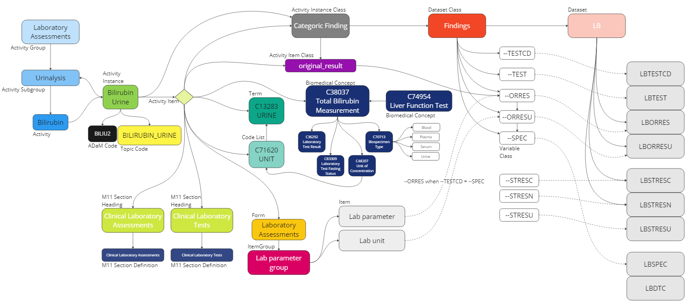
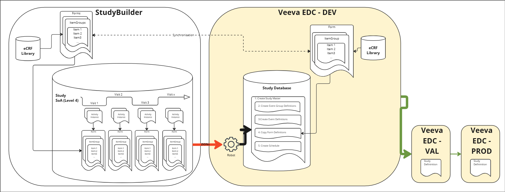
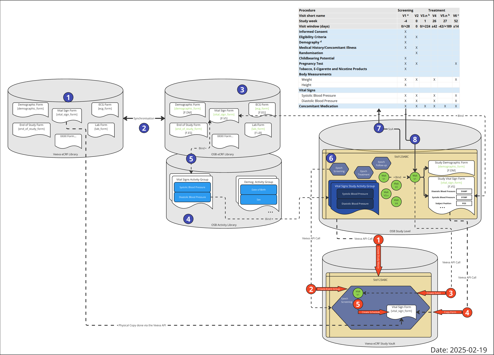

# Beyond concepts {: class="guideH1"}

(created 2025-02-21) 
{: class="guideCreated"}

The activity concepts as explained in the corresponding [guide](./guide_activity_concept.md) goes beyond the usage of the definition for the Schedule of Activities. The concept is a core part of the linking of required information to enable and trace the stream from defining an activity in the protocol, through a data specification which can then be used in a concrete data collection, this will go into a concrete location in the data model(s) and can then later on be linked up to analysis results.

This documentation will go into the details of the current linkage and the concept for synchronization and down stream utilization in a specific EDC system (Veeva EDC).

## Linking vision

The idea is to create and utilize a connecting flow - define once and use many times!

The core elements are to be liked together:

- Protocol definition
- CRF utilization
- EDC specification
- SDTM definition
- ADAM definition

The activities, which are for example any kind of laboratory tests, build the base for the linkage. The following example shows how it could be envisioned in general. 

{: class="imageParagraph"}

Figure 1: Linking all together - a high level vision
{: class="imageDescription"}

In the first place, there is an activitiy with a specific meaning, for example "Bilirubin". This activity belongs to a group and subgroup - in the example it is a "Laboratory Assessment" belonging to the "Urinanalysis". For the **protocol**, this is the information required. 

For the **data specification**, this information is not sufficient. Even though there is a good understanding on what should be done in the study, there are still different ways how to collect and where it should go into. For the urine Bilirubin, we could collect the a concrete numerical value value or just collect the category (e.g. "normal", "high", "low"). To be specific, we define an activity instance.

This activity instance is a very concrete item. For this we could store many **connecting information**:

- To which section of M11 does this activitiy belong
- Concrete CRF location (Form, ItemGroup, Item), sometimes even multiple items, as a test often comes as a parameter value and unit
- Expected mapping to a data model (in this case SDTM) including the various variables and additional depending variables and values
- Associated codelists and only specific codelists values (the "UNIT" codelist contains just very few units which are applicalble to the concrete activity)
- Associated official CDISC Biomedical Concepts

When having this definition available - for a concrete study, the protocol activities could be selected and later on decided on the concrete data specification. With just these two selections, 

## Current Mapping Implementation

{: class="imageParagraph"}

Figure 2: Linking all together - Current Mapping Implementation Example
{: class="imageDescription"}

## Veeva Integration High Level Overview

{: class="imageParagraph"}

Figure 3: TODO
{: class="imageDescription"}

## Veeva Integration Detailed Plan

{: class="imageParagraph"}

Figure 4: TODO
{: class="imageDescription"}