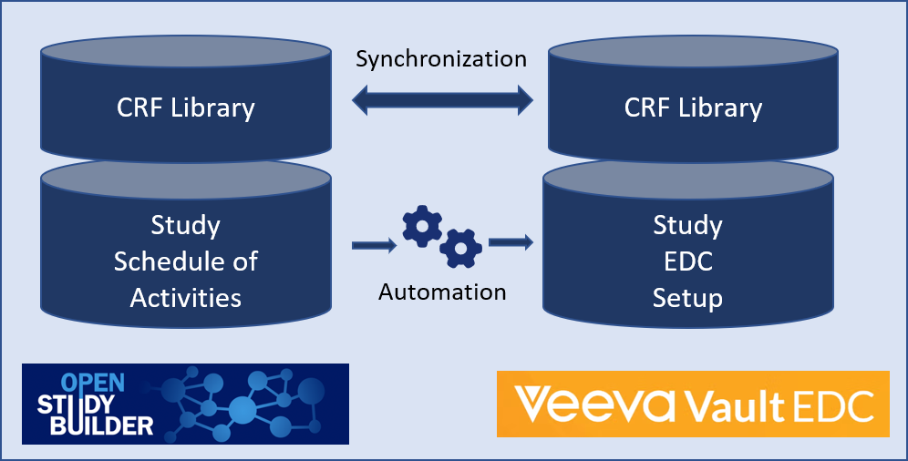
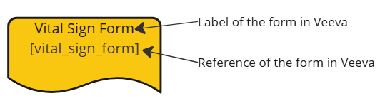
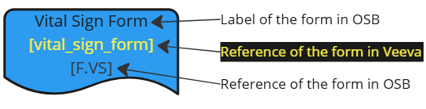
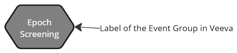
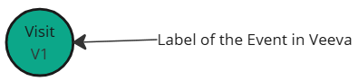
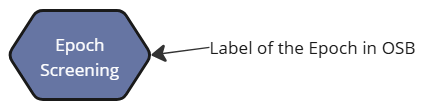
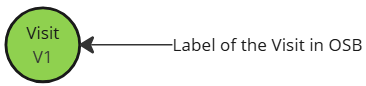
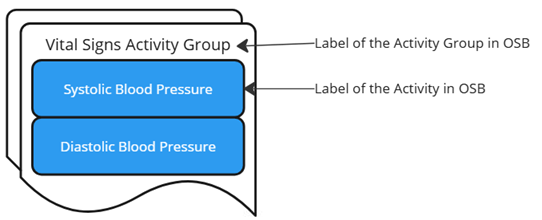
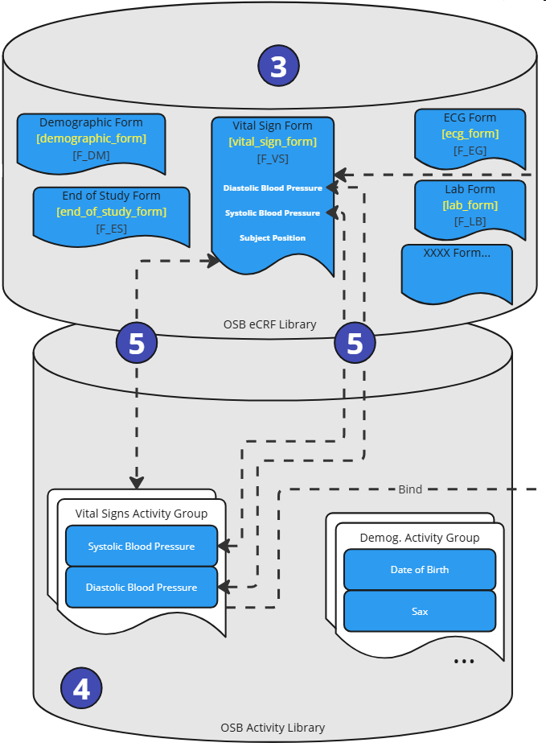
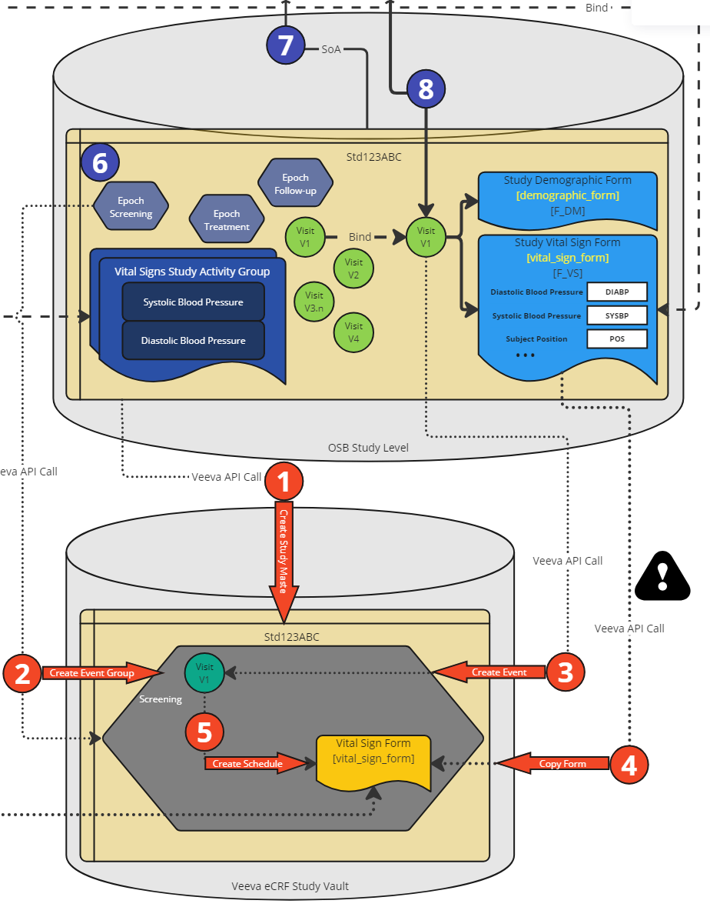

# Beyond concepts {: class="guideH1"}

(created 2025-02-21) 
{: class="guideCreated"}

The activity concepts, as explained in the corresponding [guide](./guide_activity_concept.md), extend beyond the definition used for the Schedule of Activities. These concepts are crucial for linking the necessary information to enable and trace the flow from defining an activity in the protocol, through a data specification that can then be used in a concrete data collection. This information will be placed in a specific location within the data model(s), e.g. SDTM, and can later be linked to analysis results.

This documentation delves into the details of the current linkage (comparable to Biomedical Concepts) and the concept for synchronization and downstream utilization in a specific EDC system, illustrated via Veeva EDC. It is related to the CDISC Biomedical Concepts, which are described [here](https://www.cdisc.org/cdisc-biomedical-concepts).

## Linking vision

The idea is to create and utilize a connecting flow - define once and use many times!

The core elements are to be linked together:

- Protocol definition
- CRF utilization
- EDC specification
- SDTM definition
- ADAM definition

The activities, which are for example any kind of laboratory tests, build the base for the linkage. The following example shows how it could be envisioned in general. 

{target=_blank}
{: class="imageParagraph"}

Figure 1: Linking All Together - High Level Vision
{: class="imageDescription"}

In the first place, there is an activity with a specific meaning, for example, "Bilirubin". This activity belongs to a group and subgroup - in this example, it is a "Laboratory Assessment" belonging to the "Urinalysis." This is defined in the Library part, under the Concepts. For the **protocol**, this is the required information in the Study Definition, under the Study Activity part.

For the **data specification**, this information is not sufficient. Even though there is a good understanding on what should be done in the study, there are still different ways how to collect and where it should go into. For the "Urine Bilirubin" activity, we could collect this as concrete numerical values or just collect the category (e.g. "normal", "high", "low"). To be specific, we define an activity instance.

This activity instance is a very concrete item. For this we could store many **connecting information**:

- To which section of M11 does this activity belong
- Concrete CRF location (Form, ItemGroup, Item), sometimes even multiple items, as a test often comes as a parameter value and unit, or even with more qualifiers like the position of the subject during the examination
- Expected mapping to a data model (in this case SDTM) including the various variables and additional depending variables and values
- Associated codelists and only specific codelists values (the "UNIT" codelist contains just very few units which are applicable to the concrete activity). We sometime call them sub-codelists.
- Associated official CDISC Biomedical Concepts

When having this definition available - for a concrete study, the protocol activities could be selected and later on decided on the concrete data specification. With just these two selections and all the standard mapping done in the background, it's possible to utilize this downstream to define the corresponding CRF items and see already the mapping to the SDTM variables.

## Current Mapping Implementation

In the end, the mapping is a bit more complex having specific relationships of types. The following visualization shows the current implementation planning and status of the linking of the activities to the concrete data specification and beyond.

{target=_blank}
{: class="imageParagraph"}

Figure 2: Linking all Together - Current Mapping Implementation Example
{: class="imageDescription"}

What is important to notice is the differentiation between an "Activity" and an "Activity Instance". The activity is the general definition and used in the protocol, whereas the instance is the concrete definition of the data specification and the mapping to the data model(s) and beyond. It can be seen as the glue to connect every clinical concept together.

As an example, we could have a look at the "Bilirubin" activity. This could go into different groups and subgroups - concretely into:

- Group: "Laboratory Assessment" - Sub-group: "Urinalysis"
- Group: "Laboratory Assessment" - Sub-group: "Biochemistry" 
- Group "AE Requiring Additional Data" - Sub-group: "Laboratory Assessment"

{: class="imageParagraph"}

Figure 3: Activities and Activity Instances in OpenStudyBuilder
{: class="imageDescription"}

Then there are concrete instances which build the data specification. These could be numeric values or categories and have additional specification each.

## Veeva Integration High Level Overview

We are working on integrating the Veeva EDC System with the OpenStudyBuilder. The following high-level overview shows the main idea.

{: class="imageParagraph"}

Figure 4: High Level Overview of Veeva EDC Integration Plans
{: class="imageDescription"}

We plan to synchronize the Veeva EDC CRF Library and the OpenStudyBuilder CRF library. These OpenStudyBuilder library elements are then linked to activity instances which are used in the study specific Schedule of Activities (SoA). This will trigger an automation which will setup the Study in the EDC setup in Veeva EDC.

{target=_blank}
{: class="imageParagraph"}

Figure 5: Overview of Veeva EDC Integration Plans
{: class="imageDescription"}

**In short** - the currently plan is the following:

- Maintain CRF Forms, ItemGroups and Items in Veeva EDC
- Synchronize CRF objects to OpenStudyBuilder (keep linking information,  with a compare tool that will keep the synchronisation between the Veeva and the OpenStudyBuilder Library) 
- Select activity instances in Schedule of Activities for timepoints (which are linked to CRF objects). Those timepoints will be used by the Veeva EDC as visits.
- Create a Python file(called here the "Robot") to call the Veeva API to setup a new empty Veeva EDC study. It will afterwards create the visits and then copies the corresponding forms and elements from the library 
- Use this for VAL and PROD to have the study setup in Veeva EDC

**Explanation** 

In the OpenStudyBuilder the CRF relevant information is defined in the library module in Forms, ItemGroups and Items. The Veeva EDC System contains also a CRF Library module storing the same. The idea is to have a synchronization job to keep both libraries containing the same information, containing linkage information in OpenStudyBuilder. Due to the limitations of the current version of the Veeva API, the current plan is to maintain and update the form information within the Veeva system and create the corresponding objects in OpenStudyBuilder via an automation job.

A futher step is required to update and maintain the data specifications. For activities which are rough concepts, we need to define activity instances - which is a concrete definition of the data specification. This contains next to the final SDTM location for example additionally the form, item and item group links. This is typically done by a standards function at the Library level of the OpenStudyBuilder.

On study setup, an activity is selected for the schedule of activities which is used in the clinical protocol, after the Epoch and the Visits have been created. Then these activities are further fine-tuned with selecting the activity instances. By selecting the activity instance, the linkage of a selected activity and the corresponding required CRF elements is available, for each dedicated visit.

This specification can now be used to generate a very specific formatted JSON file, which can then be consumed by a Python script that is calling the Veeva API to setup the study in Veeva EDC. We are working on a process (robot), to setup the Veeva EDC study database:

- Create Study Master (this is an empty new study in Veeva)
- Create Event Group Definitions (this is a group of events – working like a Cycle in an oncologic study)
- Create Event Definitions (based on the OpenStudyBuilder visits used by the SoA)
- Copy Form Definitions from the Veeva CRF Library (based on the Activity Instances selected in the SoA, linked to the eCRF forms)
- Create Schedule (binding the Veeva Forms to the Event created before)

This is then checked in the Veeva EDC system and will then be used for the study setup in VAL and PROD.

## Veeva Integration Detailed Plan

Actually, to see the details of the elements and how this is all linked together, a more detailed view is required. The following section describes additional details. 

{target=_blank}
{: class="imageParagraph"}

Figure 6: Detailed Overview of Veeva EDC Integration Plans
{: class="imageDescription"}

The following legend is used to describe the elements:

Description | Icon
--- | ---
Veeva EDC Form | 
OpenStudyBuilder Form | 
Steps not fully supported | 
Veeva event group | 
Veeva event label | 
OpenStudyBuilder Epoch | 
OpenStudyBuilder Visit | 
OpenStudyBuilder Activity | 

Let's get through the process steps.

{: class="imageParagraph"}

Figure 7: Process Steps - eCRF Libraries
{: class="imageDescription"}

As a first steps, the eCRF forms are created in the Veeva eCRF Library including the ItemGroups and Items (1). An important value is the reference ID. The synchronization job (2) will create the corresponding objects in the OpenStudyBuilder eCRF library (3) using additionally the linkage information (reference ID).

{: class="imageParagraph"}

Figure 8: Process Steps - Activity Setup
{: class="imageDescription"}

In the steps step, the activity instances needs to be enhanced. Within the OpenStudyBuilder Activity Library (4), the activity (general concepts) and activity instances (dataset specifications) are managed. The activity instances are linked to the CRF elements (5). The link to the Form, ItemGroup and Item is managed in accordance with the ODM standard.

{: class="imageParagraph"}

Figure 8: Process Steps - Study SoA Setup
{: class="imageDescription"}

In a study (6), in the OpenStudyBuilder, a schedule of activity (SoA) is created (7). In the study, epochs are defined and used along with visits. A specific activity is selected for the study protocol and further fine-tuned by selecting a corresponding connected activity instance and associated with specific visits. As the linkage information is available in the standard, the visits can bind to concrete eCRF Forms including ItemGroups and Items (8).

{: class="imageParagraph"}

Figure 8: Process Steps - Veeva EDC Study Setup
{: class="imageDescription"}

As we are now having all required information available, the Veeva EDC setup for the specific study can be created. First (1), the study is created if not already available storing the ID back in OpenStudyBuilder. Then the event group definitions are created (2) containing the Epochs (this is a first approach). The next step created events (3) which corresponds to the visit. The form definitions are copied from the Veeva eCRF Library (4) using the ID which are stored along. Finally the Schedule is created (5) assigning the visits to the forms.

There is a "robot" program which creates and performs the final required API calls in the Veeva EDC system. This automatic setup is performed in a DEV instance of the Veeva EDC system. After setup, checks can be performed within Veeva and then the study can be setup in VAL and PROD afterwards.

