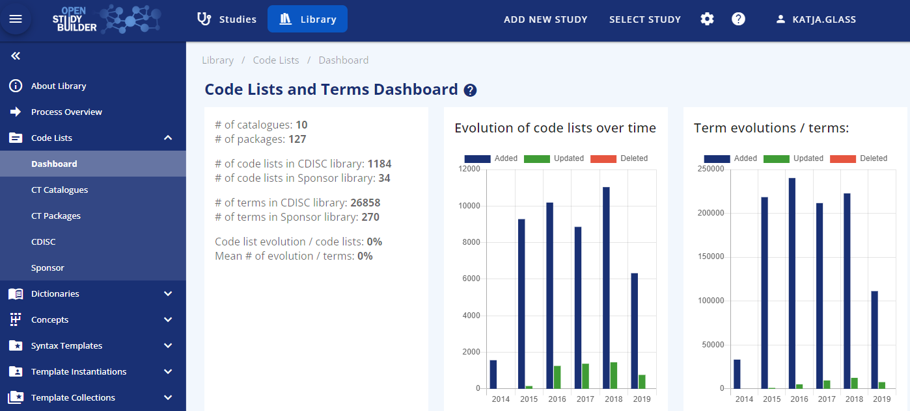
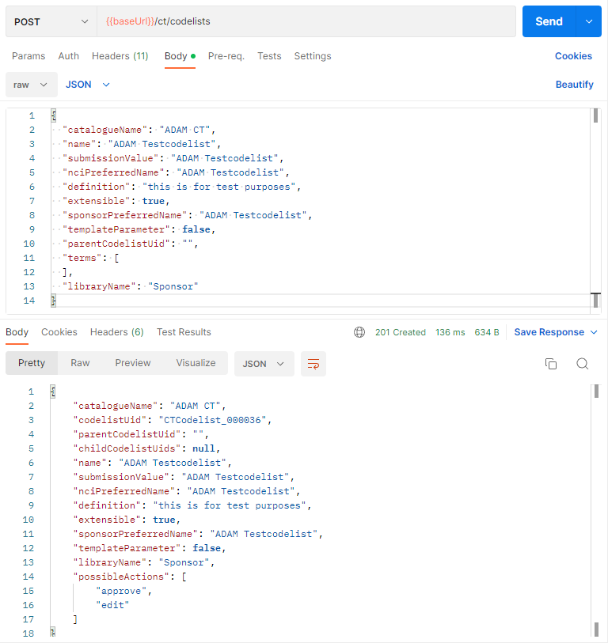

# Guide for Codelist Management {: class="guideH1"}

(created 2022-11-25 using v0.1) 
{: class="guideCreated"}

The OpenStudyBuilder is an open-source project for both a data standards metadata repository (MDR) as well as a study definitions repository (SDR). OpenStudyBuilder is capable of supporting the end-to-end automation of clinical trials in many ways. One main aspect is the management of codelists including CDISC controlled terminology and sponsor specific terminology.

The code lists come along in the application within their own section. As this is a general part, it is maintained in the "Library" section of the solution. A dashboard gives you a brief overview of the different catalogues, packages, codelists and terms. This extract is coming from the evaluation environment.

## Browse and Update Standards in Application

Under "CT Catalogues" all CDISC Controlled Terminology standards which are loaded can be browsed. The search is very quick and powerful. You can search for a codelist name or a term within that codelist. When "male" is searched, the "sex" codelist will be listed as well.

In addition to the CDISC standards, each codelist has an additional "Sponsor Preferred Name" and an indicator of whether it is a "Template Parameter". The codelist terms support the following attached additional information: "Sponsor Preferred Name", "Sentence case name" and "Order". Such additions to the codelists and terms can be used to automate follow-up processes, for example when this term should be used within a sentence or you also want to maintain a specific order. If browsing an extensible codelist, the option to "add term" is available to allow this.

The "Sponsor" codelists is the area where all custom codelists can be maintained. New codelists can be added, terms can be added and modified and similar. Example sponsor codelists are: VisitType, Epoch Type and Arm Type.

To be able to use available codelists on studies, these must be in the status "Final". Whenever modifications or additions are performed, make sure to "Change status to Final" for the terms and codelist.

A nice feature of the application is the display of the changes between different versions. In "Code Lists" and "CT Packaged" the different versions of the standard controlled terminologies are listed. This allows to browse a specific version only. When clicking the "time history" button, different version can be selected and the differences are made available. The ADAM CT has for example just a few changes between the version from 2014-09-26 to 2021-12-17.

## Codelist Related Structure

The OpenStudyBuilder uses "CT Catalogues" to categorize codelists. This contains the standard as a whole. Example are ADAM CT, SDTM CT, CDASH CT, SEND CT but also GLOSSARY CT, QRS CT and similar. Sponsor-specific codelists are typically maintained below the main standard, so if these are mainly SDTM-related these would also be below "SDTM CT". Next to this the "library" differs between CDISC and sponsor codelists.

The CDISC CT is being shipped in packages. These are maintained as packages in the OpenStudyBuilder as well. Every package belongs to a catalog and these have references to single codelist item.

The core element is the codelist item. This comes along with a name, a submission value, the NCI preferred name, a definition and the indicator whether it is extensible or not. Additionally, a sponsor preferred name is stored along with an indicator of whether this codelist can be used as template parameter. One well known codelist is named "Sex". 

The terms are specific characteristics of a codelist which could be for example "M" and "F" belonging to the "Sex" codelist. Next to the CDISC provided attributes like concept ID, code submission value, NCI preferred name, definition and synonyms, the OpenStudyBuilder stores a sponsor preferred name, sentence case name and an order number along.

## Scripts to Create / Update Codelists

The management of codelists within the application is nice, but especially the CDISC Controlled Terminology should be loaded via script. The initial load of sponsor specific codelists can easily be handled via script as well. The repository scripts are working with the direct database connection. Another way would be the utilization of APIs (see next chapter).

The OpenStudyBuilder comes along with scripts to load standards. These can be found in the "mdr-standards-import" location here. The corresponding readme files explains the process steps needed to upload standards. To be able to use the CDISC Library API, you need to create an account and get an authentication token for this. After registration and login, you can open the CDISC Library browser, go to settings (top-right), then "API Portal". Under "API Key", the primary key is shown and can be copied.

The following example is expecting that the OpenStudyBuilder is running in a local docker environment as described in the main readme file of the repository. In the command line tool, go to the repository location into the mdr-standards-import folder. Now we can follow along the instructions. Install the packages. Create the .env file as described and include your API key for the CDISC Library. Additionally create the folder "cdisc_data/packages" to store the CDISC library download intermediately. Please note the port numbers - when docker is used these are 5001 (HTTP) and 5002 (BOLT) and the default password is "changeme1234". Please note as well that you have to provide the full absolute path as parameter in the download call.

The next step could be to load the controlled terminology to two databases, the "CDISC CT DB" and the "MDR DB". The script has three parameters. The first one is the initials, the second one the path and the third one defines whether or not to skip the download process from the CDISC API. For the path, use the absolute path without quotes. Please note that this step can run for some hours for the initial load.

There is also a script to load sponsor specific codelists and terms into the OpenStudyBuilder as part of the ‘data-import’ component. The script needs some updates and the documentation is currently not complete. The content is maintained in simple CSV files which is then transferred into the database.  For more info see the Readme.md in the ‘data-import’ component. 

## APIs to Create / Update Codelists

A main strength of the OpenStudyBuilder is the powerful interface available via REST API. This means all processes could be managed by any programming language just by utilizing this API. This could be done directly with SAS, R, Python and many more. The available swagger API documentation can be used to run the calls as well - in docker via http://localhost:5005/api/docs. This documentation can also be loaded to "Postman" which is a great tool working with APIs in general.

It is a nice way to create new sponsor specific codelists via API. The API endpoint for catalogue and packages only provide information and cannot be used to create these. It is intended that the catalogues and packages come from standard imports loaded directly into the database. The sponsor specifics are added as codelists and terms. Ideally create first the codelist and then the terminology which is assigned to the codelist.

If you currently maintain your sponsor defined terminologies within an existing MDR solution and wish to continue to do so, then this principle of API based imports and updates will enable you to build a system integration from your existing MDR solution to the OpenStudyBuilder MDR solution.

Next to creating codelists and terminology, also the required approval can be done via the API. Loading sponsor specific codelists and terminology with the API is straight forward.

## APIs to Download Codelists

Finally, when all codelists are managed in this MDR, these could be made available in downstream systems for usage. In the current status of the MDR, the single codelists and terminology is not linked on study level. For this it is currently not possible to download all codelists related to a specific study. But you can get all codelists and terms for specific filters. There are various API endpoints available.

The API output format is always JSON, so it might be required to load the JSON format finally to other formats, for example into SAS datasets when these should be stored or processed in other systems. To be able to create connected SAS format catalogues it would for example be required to download the CT codelists and merge them with the CT terms. Additional API endpoints are likely to be added to support such and similar use cases in the future.

## Integrations to other MDRs / SDR

The APIs are designed to support easy integrations to other repositories. Data cannot only be loaded from direct scripts or direct API calls, but can also be automated by processes. There could for example be automatic imports/exports from and to other repositories like the TransCelerate Digital Data Flow Reference implementation. The corresponding DDF API adapter will be available soon for this. This has been demonstrated (see the first video here) but still needs some finetuning.