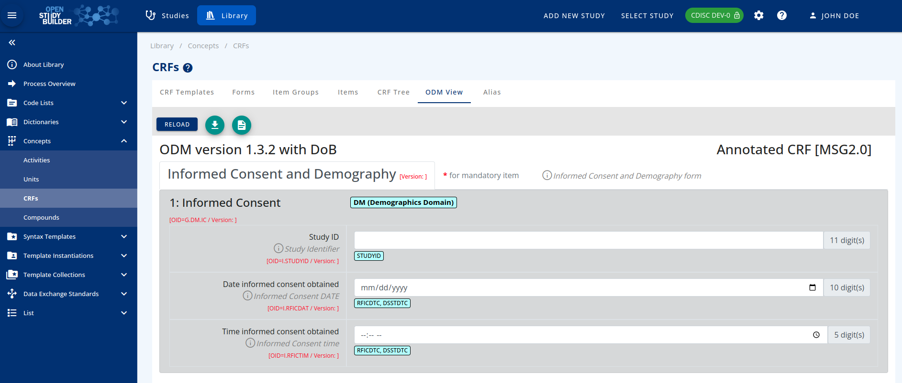

# Guide for Case Report Form (CRF) {: class="guideH1"}

(created 2022-12-12 using v0.2) 
{: class="guideCreated"}

The OpenStudyBuilder offers a Case Report Form (CRF) management feature in both the library and at the study level. For the moment - version 0.2 - the CRF is only available inside the library. We follow the CDISC Operational Data Model (ODM) with respect to terminology, structure and as import/export format as this is our industry standard and fits best connectivity requirements.

The following video provides a great overview of the CRF featues available in version 0.2:

<iframe
  title="CRF support in OpenStudyBuilder"
  width=720
  height=405
  src="https://www.youtube-nocookie.com/embed/ubG9IJU9wVQ"
  frameBorder="0"
  allow="accelerometer; encrypted-media; gyroscope; picture-in-picture"
  allowFullScreen
></iframe>

The idea is to allow the end user to create Forms, Item Groups and Items for a CRF and bind them inside a template. This template can be validated and reused. It is possible to link its metadata to the activities that are also available in the library, and allows usage by the protocol. 

This linking and metadata allows for automation and traceability, which is a main benefit for Biomedical Concepts.

{: class="imageParagraph"}

Figure 1: Screenshot of the CRF Tree in the OpenStudyBuilder
{: class="imageDescription"}

The CRFs part can be accessed by browsing the "Concepts" menu in the library.

## Template Management

The first step is to create a Template. By clicking on the **Add** button, a new Template can be defined with:

-	A dedicated Name,
-	A unique Object Identifier (OID) - if empty, OpenStudyBuilder will generate this
-	Optionally specify a start (effective) and an end (obsolete) date

Perform validation and set the validated flag to be able to use it outside the library.

Clicking on the Relation icon in the table allows to see how this **T**emplate is linked to other CRF elements. The following image shows a small example of a template containing the **F**orm "Informed Consent and Demography", which contains two item**G**roups, one is "Informed Consent" which holds three single **I**tems, one example is "Study ID".

{: class="imageParagraph"}

Figure 2: Relation of a Template with other CRF elements
{: class="imageDescription"}

## Form Management

The forms tab allows to access to the list of available forms in the library.
By clicking the **Add** button, a dedicated page with a stepper system (with 2 steps) is opened. The first step deals with the definition of your form. The following needs to be provided:

-	In the Definition part:
    -	Mandatory name,
    -	OID - we recommend a prefix of F. (example: F.DM),
    -	Is the form repeated or not,
    -	Description and implementation notes,
-	In the Display part:
    -	Display text (that can be used on the CRF as the full name of the form),
    -	Some completion Instructions.
  
In the second step, alternative names, so called "Aliases", can be defined by providing:

-	Context (application domain, for example SDTM),
-	Name (for example DM:Demographics).

Save the Form and it will be added to the list in the table. Again, remember to validate it to enable form usage.

## ItemGroups Management

An item group is an operational data model element (see ['Specification for the Operational Data Model (ODM) Version 1.3.2 Production'](https://www.cdisc.org/standards/foundational/odm-xml/odm-xml-v1-3-2) document available on the web site of CDISC) that groups a set of items that are consistent together.

The corresponding tab lists every ItemGroup available in the library.

By clicking the **Add** button, the following information can be entered:

-	In the definition part:
    -	Mandatory Name,
    -	OID - recommendation to start with "G.",
    -	Is the ItemGroup repeated or not,
    -	Description and implementation notes,
-	In the display part:
    -	Display text (that can be used on the CRF as the full name of the Form),
    -	Some completion instructions,
-	In the annotations and reporting part:
    -	Select one or more Domain(s) - will be used in the annotated version of the CRF,
    -	One or more SAS dataset name (could be used by connecting systems),
    -	Specify if this ItemGroup is or not referential data (If "IsReferenceData" is "Yes", this type of item group can occur only within a "ReferenceData" element - See the Specification for the Operational Data Model (ODM) Version 1.3.2 Production for more information),
    -	Select an origin for your ItemGroup (could be used when creating define.xml for SDTM),
    -	Role - this is deprecated, leave it empty,
    -	Purpose is always set to Tabulation for now,
    -	Comment field for additional information.

In the second step, Alias could be provided:

-	Context (e.g.: SDTM),
-	Name (e.g.: DM:Demographics).

The ItemGroup will be added to the list in the table on save. Again, remember to validate it as only then it can be used later on.

## Item Management

Finally, items can be added. It describes a type of item that can occur within a study. Item properties include name, datatype, measurement units, range or codelist restrictions, and several other properties.

Add an item by clicking on the dedicated button. This will open a page asking the user to provide the following information:

-	In the Definition part:
    -	Mandatory Name,
    -	OID - recommend starting with "I." as Item,
    -	Data type (please note that this list is based on a Sponsor Codelist allowing the end user to add new data types if needed),
    -	Based on the data type: provide length (this will represent the max length of the item)
    -	For float items, please provide the number of significant digits,
    -	Description and implementation notes,
-	In the Display part:
    -	Display text (that can be used on the CRF as the full name of the Form),
    -	Completion instructions,
    -	In the Annotations and Reporting part:
    -	One or more SAS field names (that can be used by connected systems),
    -	One SDS Var Name - in order to have an annotated CRF with color coding defined in the Metadata Submission Guideline Version 2.0 (MSG 2.0), the SDS Var Name could be as follow: DM:RFICDTC|DS:DSSTDTC (Note: this is breaking the ODM validation schema),
    -	Origin for your item - by selecting 'Protocol Value’, the CRF will use a disabled field,
    -	Comment field for additional information.

The second step will depend on the data type of the item:

-	For TEXT, DATE, TIME, DATETIME, BOOLEAN, DOUBLE, HEXBINARY, BASE64BINARY, HEXFLOAT, BASE64FLOAT, PARTIALDATE, PARTIALDATETIME, DURATIONDATETIME, INTERVALEDATETIME, INCOMPLETEDATETIME, INCOMPLETEDATE, INCOMPLETETIME and URI, Alias can be added by providing:
    -	Context (e.g., SDTM),
    -	Name (e.g., RFICDTC).
-	For INTEGER and FLOAT:
    -	Select used unit - click on **Add** and search in the dropdown menu.
-	For STRING:
    -	Select corresponding codelist used by the item - search in the list and select accordingly, multiple codelists can be added,
    -	Select terms from the selected codelist that are applicable to the item.

{: class="imageParagraph"}

Figure 3: Code List Subset example 
{: class="imageDescription"}

Save your item and it will be added to the list in the table. Again, remember to validate it. Then this item can be used elsewhere in the OpenStudyBuilder.

## Time to link them all

Clicking on the CRF tree tab displays the list of existing templates. This is the page where the structure of our CRFs is defined by managing the hierarchy inside a template. It links the forms that contain ItemGroups which contain the items. In order to do that, the CRF elements need to be in draft status.

By clicking the plus button of each row, the list of elements that can be linked at this level is shown. For example, when looking at the available example form 'Informed Consent and Demography’, then the OpenStudyBuilder will allow the addition of an ItemGroup.

This addition could be for:

-	A Form to a Template
-	An ItemGroup to a Form
-	An Item to an ItemGroup

Finally, the template definition can be finished. To do so - click on the 3 dots in front of each element to open a menu with the following features:

-	Set condition:  to define conditional structure between elements,
-	Go to definition: to edit the element or review the metadata - this is also a way to create a new version of the element,
-	Edit reference attributes: to setup attributes like Locked (Yes/No), Mandatory (Yes/No), Source Data Verification (SDV as a Yes/No) or Data Entry Required (Yes/no) - those attributes will be added in the ODM-xml file as vendor extension,
-	Approve All: to automatically set the Status to FINAL and update the version of every element to the next one,
-	Duplicate: to duplicate an element and create a new independent instance of it,
-	Previous ODM: to open the ODM View for this element, even if it is still in Draft status.

Please note that by enabling the "Reorder Content" switch, it is possible to move the elements inside the template with drag and drop.

## See the blank or the annotated CRF!

The end user will be able to view the case report form as a blank CRF or with SDTM annotations in the ODM view tab.

By default, this page display two dropdown menus:

-	ODM Element Type: to select the level to view as a HTML page:
    -	Template: to display the Form(s), the ItemGroup(s) and the Item(s) handle by the template,
    -	Form: to display the ItemGroup(s) and the Item(s) inside a Form only,
    -	ItemGroup: to display the Item(s) inside an ItemGroup,
    -	Item: To display the selected Item only.
-	ODM Element Name: Based on the level selected, select the element to display.
    -	The tick box "Include Draft Element" allows to display or hide elements that are not yet validated,
-	Finally, select the stylesheet to be applied: Blank or Annotated (without or with SDTM Annotations)

The load button will open corresponding the ODM-XML file.

{: class="imageParagraph"}

Figure 4: CRF with SDTM Annotations 
{: class="imageDescription"}

## The Aliases

The last tab of the CRFs menu deals with the aliases created inside each element. New aliases could be added here and used where needed.

New aliases can be included with the **Add** button with the attributes:

-	Context,
-	Name

{: class="imageParagraph"}

Figure 5: Alias management in the OpenStudyBuilder 
{: class="imageDescription"}

## CRFs from the API!

All CRF related metadata and the ODM content can be managed and browsed throughout the OpenStudyBuilder REST API. This enables the connectivity to any other systems including EDC tools! Open the Swagger interface and browse every Endpoint starting with an ODM prefix for a detailed overview.

The following endpoints deal specifically with CRFs to receive or create:

-	ODM Templates
-	ODM Forms
-	ODM Item Groups
-	ODM Item
-	ODM Conditions
-	ODM Formal Expressions
-	ODM Descriptions
-	ODM Aliases
-	ODM XML Extensions
-	ODM XML Extension Attributes
-	ODM XML Extension Tags
-	ODM Metadata Import/Export

## Remarks 0.2 try-out

In case the **"ODM Tree"** does not display linked items when you have added links, please re-load the page and click the three dots to "Expand all". If this is not working, click in the row in the very first region where in the screenshot an arrow is available. 

When nothing can be selected for the **"ODM View"**, there are very likely no "final" versions available for display. At least approve one template to be able to try this out. Unluckily there is currently a minor bug available in the local installation, so the display is not working on the docker-environment. Nevertheless, the odm.xml can be downloaded via the API in any case.

When using the **API**, the default documentation often contains a filled "filter" example, remember to remove this content when you trying an API call. 
