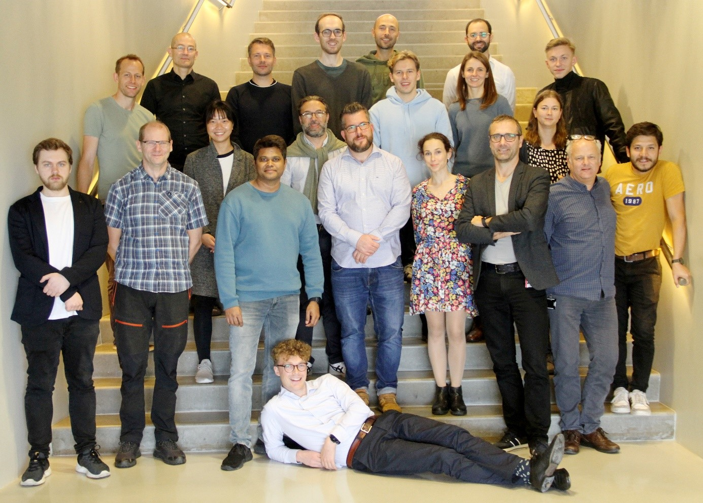

# Introduction to OpenStudyBuilder

## Release of OpenStudyBuilder

The OpenStudyBuilder has been released on 24.10.2022 and is available as open source in [GitLab](https://gitlab.com/Novo-Nordisk/nn-public/openstudybuilder/OpenStudyBuilder-Solution){target=_blank}! You can check out this metadata repository together with the graph data containing a biomedical concept by installing it locally or you can request access to the sandbox system to play around with example data even without installing anything!  

Thanks to Novo Nordisk for sharing this as open source to enable the next level of collaboration! 

## What is the OpenStudyBuilder?

The OpenStudyBuilder is an open-source project for clinical study specifications. This tool is a new approach for working with studies that once fully implemented will drive end-to-end consistency and more efficient processes - all the way from protocol development and CRF design - to creation of datasets, analysis, reporting, submission to health authorities and public disclosure of study information.

The heart is the Metadata Repository using a graph database containing a biomedical concept. This allows for FAIR data, semantics, traceability and automation. Then there is the Application itself where all data can be browsed, entered, updated and managed. And finally, there is a very powerful API which provides the complete functionality through a standard interface!

### The Library

In the library section you can browse all kinds of standards, like for CDISC the SDTM, ADAM, SEND, CDASH and many more. Also, other dictionaries like SNOMED, LOINC, UCUM is available - MedDRA could be loaded as well of course. Want to see differences of different SDTM versions? No Problem with the OpenStudyBuilder! 
As everything is FAIR, concepts can be created and maintained, so these can easily be reused. A core feature is the usage of syntax templates, for example for objectives and endpoints. Here general standard wordings and types are defined, which can then be instantiated with a concrete compound or comparator. 

### The Study Area

All study-related content which is needed for the protocol and Trial Domains can be managed in the study area. Objectives, endpoints, study design, population - whatever is needed can be entered. There is also a nice protocol flowchart.  

### The API

The API provides a standard interface which is very powerful. The application itself uses the API to update the database. Everything could also be done by using the API in a different fashion. Notable is also the DDF API Adapter which supports the TransCelerate Digital Data Flow (DDF) connections. 

### The Documentation

This project homepage contains core information as well as information about upcoming [events](info_events.md). For instructions on how to install all components together or just single components, see the single readme files in the [GitLab repository](https://gitlab.com/Novo-Nordisk/nn-public/openstudybuilder/OpenStudyBuilder-Solution){target=_blank}. And finally, there is also the documentation portal with the documentation coming along with the tool itself – this is accessible through the Sandbox system [here](https://openstudybuilder.northeurope.cloudapp.azure.com/doc/){target=_blank}. 

## Demonstration Video

The following video shows the demonstration of the OpenStudyBuilder Application in Version 0.4.

<iframe
  title="OpenStudyBuilder - Demonstration of Application"
  width=720
  height=405
  src="https://www.youtube-nocookie.com/embed/dL5CY0BwfEs"
  frameBorder="0"
  allow="accelerometer; encrypted-media; gyroscope; picture-in-picture"
  allowFullScreen
></iframe>

## Background and Scope

The following video describes the background and scope.

<iframe
  title="OpenStudyBuilder - Background & Scope"
  width=720
  height=405
  src="https://www.youtube-nocookie.com/embed/dagWWR3ZBao"
  frameBorder="0"
  allow="accelerometer; encrypted-media; gyroscope; picture-in-picture"
  allowFullScreen
></iframe>

The OpenStudyBuilder as an outcome of the CDISC 360&deg; project and related to the TransCelerate Digital Data Flow Project is meant to be the core component for all study related activities and tools, managing and providing standards and study metadata. The solution comes along with tools, scripts and a graph database for industry and sponsor standards as well as study definitions. It is not meant to be an Electronic Data Capture (EDC) System, nor a Statistical Computing Environment (SCE) and it is also not planned to contain the clinical data itself. Nevertheless all the metadata is meant to be connected to those systems to enable end-to-end automation.

The OpenStudyBuilder is an ongoing project with growing functionality. We receive standards data through the CDISC library, we provide (and enhance) an API adapter to support the DDF API. We are also working with CDISC on the COSMoS model and integration as well as beeing a CDISC Open Source Alliance (COSA) member. We follow also other initiatives and plan to support them one or the other way in the OpenStudyBuilder. We are looking for example into the new ICH M11 guideline for protocol presentation, plan to support OAK and Admiral when this becomes metadata driven and follow up the Analyses Results Metadata initiative.

## DDF Context

The OpenStudyBuilder aims to become a DDF reference implementation on top of many other features. For this, any tools supporting DDF will also be able to work with the OpenStudyBuilder. Additional information on how the OpenStudyBuilder can be seen in the DDF context is available [online](info_ddf.md).

## Collaboration

The main goal for the OpenStudyBuilder as an open-source project is to allow for next level collaboration. Let's not only share ideas and discuss processes, but share concepts and tools as well! Want to enhance the biomedical concept? Create additional connecting tools? There are many ways to collaborate with us. We want to build up our community.  

Please follow our newsletter in [LinkedIn](https://www.linkedin.com/newsletters/openstudybuilder-6990328054849916928/){target=_blank}, join us in [Slack](https://join.slack.com/t/openstudybuilder/shared_invite/zt-19mtauzic-Jvrhtmy7hGstgyiIvB1Wsw){target=_blank}, write a message to the OpenStudyBuilder team via mail <a href="mailto:OpenStudyBuilder@gmail.com">OpenStudyBuilder@gmail.com</a> or get in touch with us on conferences and similar!You can use the opportunity to get access to the Sandbox environment via mail: <a href="mailto:openstudybuilder@neotechnology.com">openstudybuilder@neotechnology.com</a> - Request Sandbox Access. 

## Status and Team

Novo Nordisk is using the StudyBuilder (which is the internal name) in production to generate the protocol. The OpenStudyBuilder is contineously enhanced with new features and fixes to support all end-to-end processes along the road. It could become a game changer with a growing community where we as an industry can create a maintain an open tool landscape driven by standards. So please join us. 

It's been a pleasure to work with the OpenStudyBuilder team. Novo Nordisk managed a very beautiful group of internals and consultants.  
 
Thanks to all working on the OpenStudyBuilder in the past, currently and who will be in the future.  

