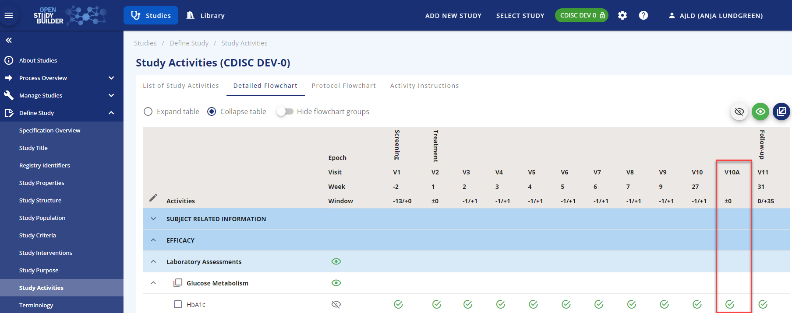
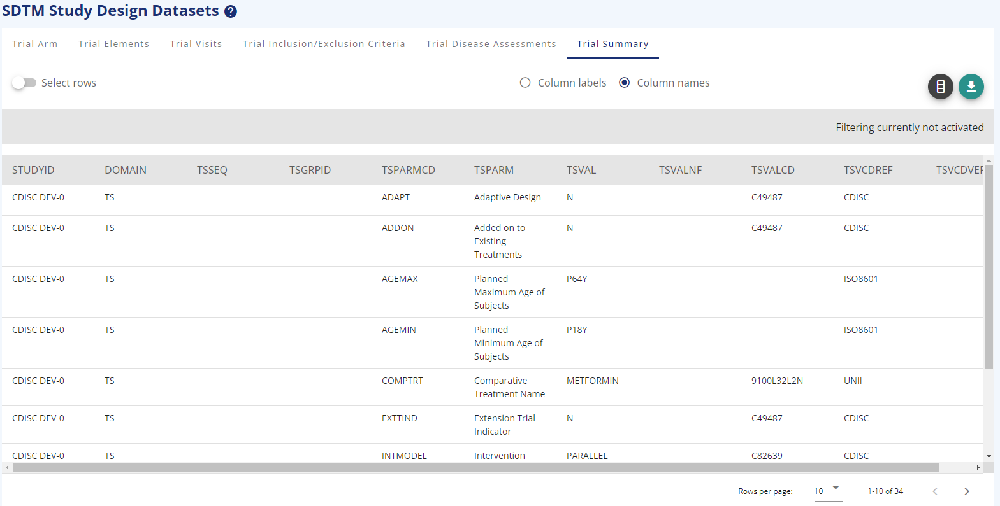

# Guide for Study Structure (Structural Study Design)

(created 2023-01-13 using v0.2) 
{: class="guideCreated"}

## Introduction

One of the main foundations in OpenStudyBuilder is the capacity to set up the Study Structure. The Study Structure consists of several parts, and further detailed descriptions are provided below the introduction. The Study Structure metadata can be used in systems and documents, e.g. for the Protocol, CRF and SDTM generation.

The study Structure menu consists of:

-	The **Overview** that provides the user with an overview of the study, that has been set up
-	The **Study Arms** which provide the option to add single or multiple arms with different arm types from Observational arms to investigational arms
-	The **Study Branches** where users can split arms to branches 
-	The **Study Cohorts** for adding cohorts for a single arm/branch or across arms/branches
-	The **Study Epochs** where the different periods in a study is described with a relation to treatment or not, and before, during or after treatment.
-	The **Study Elements** tab, where the user can specify intended main purpose within an arm in a certain period (epoch)
-	The **Study Visits** where the user can assign visits to the epoch with visit types and reference timepoints
-	The **Design Matrix** that provides an overview of the combination of arms/branches, epochs, and elements
-	The **Disease Milestone** tab describing the Disease milestones for the study.

{: class="imageParagraph"}

Figure 1: Study Overview for 2-arms, parallel study
{: class="imageDescription"}

## Study Arms

The Study Arms section is designed to support different types of studies. The user can create a study with one single arm or a study with multiple arms. There is no limitation in the number of arms from a StudyBuilder perspective. 

A Study arm must be created with the following mandatory items:

-	An **Arm name**
-	An **Arm short name**

Optional choices for study arms:

-	An **Arm type** describing the main purpose of the arm. The current arm types are a subset of the CDISC Protocol Study Arm type code list (C174222)
-	An **arm code**. The arm code can be reused as randomisation code, but it is also possible to write another randomisation code or leave randomisation code blank.
-	Add the number of subjects planned to participate in the arm. This information will also be used to calculate the total planned number of subjects for the study structure overview.
-	A free text description
-	As a specific feature across all the study structure pages, it is possible to assign a RGB colour to every part created, to make a more eye-friendly drawing for the protocol or other places (Figure 1).

{: class="imageParagraph"}

Figure 2: Trial Design with colours
{: class="imageDescription"}

## Study Branches

A study Branch is a split of an arm into two or more branches. Branches can be either considered as independent arms with a link to a study arm or as sub-arms, where participants in the main study arm to some extent follow the same path, but deviate on indication, dosing, or another parameter.

The options in a branch are like the ones for the Study arm, but it is mandatory to select a related study arm.

## Study Cohorts

The Study Cohorts section is created to support creation of cohorts 

-	With subjects from multiple arms or branches
-	With subjects from only one arm or branch
-	or simply without any relation to any arm or branch.

Cohort name, short name and cohort code are always required. 

In the case of a missing relation to an arm, it is not possible to add planned number of subjects expected for the cohort. The reason for this is that OpenStudyBuilder is validating the number of participants in a cohort against the number of subjects in related arms. If no arm is assigned, then the validation cannot take place. 

## Study Epochs

The study epochs must be setup for the different phases that the specific study goes through. 

-	**Epoch type**: The epoch type is used to specify what kind of epoch you are creating, e.g. a treatment epoch. 
-	**Epoch subtype**: Depending on your epoch type choice, you can choose different epoch sub-types in a logical setup. As an example, you cannot choose a treatment sub-type in a pre-treatment epoch type. 

The possible values are specified in the library and the epoch sub-types are based on the CDISC Epoch codelist (see Figure 2).

{: class="imageParagraph"}

Figure 3: Epoch subtype codelist based on CDISC SDTM codelist C99079
{: class="imageDescription"}

**Reorder**: You can reorder the epochs if needed by using the reorder functionality in the top of the screen. You can edit an existing epoch using the row-action menu in the three dots to the left of the row. The row-action menu can be used across most of OpenStudyBuilder with different content.

{: class="imageParagraph"}

Figure 4: Reorder functionality and row-action menu
{: class="imageDescription"}

## Study Elements

A study element is describing the intended intervention or purpose for a specific phase in the study.

A Study element is basically created by choosing:

-	**Element type** - either treatment or not treatment. 
-	**Element subtype**: In the library a logical connection has been created for choosing an element sub-type based on the element type. The code lists for element type and element sub-type are available in the library as sponsor code lists.
-	**Element name**
-	**Element short name** 
-	The rest of the items in the element form are optional. Required items are highlighted with red text if missed when saving.

{: class="imageParagraph"}

Figure 5: Mandatory items marked with red text after pressing save
{: class="imageDescription"}

## Study Visits

The study visits tab contains all the visits needed for a study. OpenStudyBuilder contains four visit types:

-	**Scheduled visit**. This is the normal visits scheduled in a study and visible in the schedule of activities
-	**Unscheduled visit**. This is primarily a technical placeholder for events happening outside normal visits and not visible in the schedule of activities
-	**Non Visit**. This is primarily a technical placeholder for data that are not visit related. This visit type is not visible in the schedule of activities
-	**Special visit**. Other visits without specific timing but related to data collection. An example is early treatment discontinuation, where certain data are to be collected, but not at the timing of the planned End of Treatment visit. The special visit is always related to another visit and is shown in the schedule of activites as visit VXXA.

{: class="imageParagraph"}

Figure 6: Special Visit added as related to visit 10 End of Treatment
{: class="imageDescription"}

The **Global Anchor Visit** is used as a reference visit with timing as '0'. This can be the first visit, the second visit or any other visit. The important part is to define which visit to use as global anchor visit as all other visits will have timing related to this visit directly or indirectly (see Figure 6).

It is possible to duplicate visits, where only difference is the timing. Other attributes can be edited using the edit button above the visit table

**NOTE**: The Global Anchor Visit is not defining a SDTM baseline (--BLFL) for any assessment.

{: class="imageParagraph"}

Figure 7: Randomisation Visit as Global Anchor Visit
{: class="imageDescription"}
 
**Groups of visits**/Visits stretching across several days can also be created in the OpenStudyBuilder. This is done via the "Add visit" form with defining an **Anchor visit in visit group** and link additional sub-visits to this anchor visit.

The detailed visit functionalities will be separately covered in another guide.

## Design Matrix

The design matrix is where you put arms/branches, epochs, and elements together to visualise what your study will look like.

You need to add the elements to the arm/epoch combination and **save your choices** before you exit the page.

{: class="imageParagraph"}

Figure 8: Design matrix in edit mode
{: class="imageDescription"}

## Disease Milestones

Disease milestones described in CDISC SDTMIG v3.3 can be added based on the need in the study. The supporting code list is available in the library as Disease Milestone Type (MIDSTYPE).

A Disease Milestone can be marked for repetition for milestones expected more than once in a study. 

## View specification

In the section below Study Structure, the section **View Specification** is available. One of the view specifications is **SDTM Study Design Datasets**. In this section, it is possible to view the study structure from another perspective. 

{: class="imageParagraph"}

Figure 9: SDTM Trial Summary View
{: class="imageDescription"}
