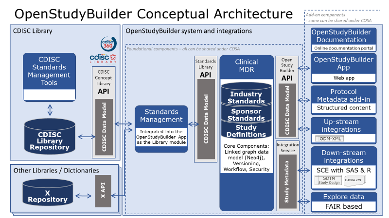
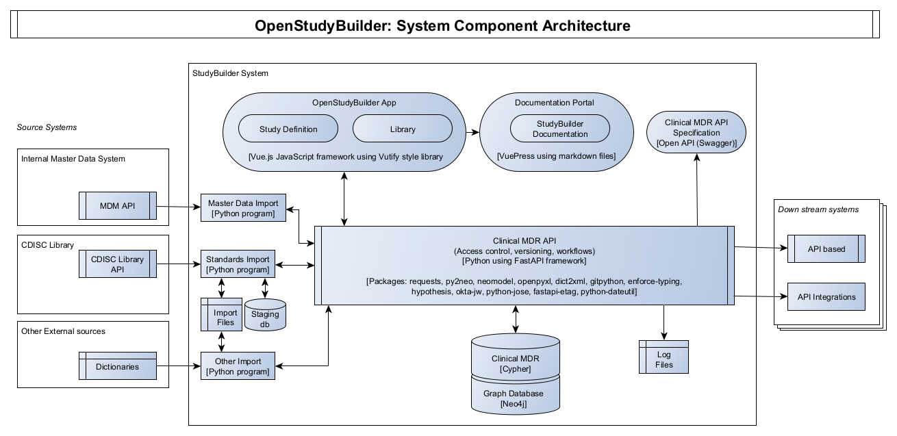

---
hide:
  - navigation
---

# OpenStudyBuilder

The OpenStudyBuilder is an open-source project for clinical study evaluations. This tool is a new approach for working with studies that once fully implemented will drive end-to-end consistency and more efficient processes - all the way from protocol development and CRF design - to creation of datasets, analysis, reporting, submission to health authorities and public disclosure of study information.

## Overview

Type | Description
-- | --
Project Type | [COSA project (CDISC Open Source Alliance)](https://cosa.cdisc.org/){target=_blank}
Owner | Novo Nordisk A/S
Contact | <a href="mailto:OpenStudyBuilder@gmail.com">OpenStudyBuilder@gmail.com</a> Regular Open Sessions planned Slack: [Join OpenStudyBuilder](https://join.slack.com/t/openstudybuilder/shared_invite/zt-19mtauzic-Jvrhtmy7hGstgyiIvB1Wsw){target=_blank}
Planned release | Q3-2022 (Source Code Release as Open Source)
Project Sub-pages | [https://gitlab.com/Novo-Nordisk/nn-public/openstudybuilder](https://gitlab.com/Novo-Nordisk/nn-public/openstudybuilder){target=_blank}
Programming Languages | Python, Cypher (Neo4j), JavaScript (Vue.js)
Licenses | Components with MIT and GPLv3, documentation CC-BY-4.0 
CDISC Standards | CDISC CT, CDASH, SDTM, ADaM with ODM-XML and Define-XML
Project Status | First productive usage in Novo Nordisk planned for Q2 2022
Users | Standards Governance, Study Designer, Standards Management, Trial Management, Medical Writing, Data Management, Biostatistics, Medical & Science, Clinical Pharmacology

## Problem

The current solutions for managing clinical data standards and study design specifications are often characterised by:

*	Resource demanding double work
*	Parallel work done in silos resulting in discrepancies and need for rework 
*	Many handovers between different professional groups introducing lag-time
*	Many IT systems and tools
*	Error-prone and resource-intensive manual steps 
*	Expensive system maintenance and integration
    
Additionally, the current CDISC standards have gaps in standards metadata, limiting automation opportunities. The inherent flexibility provided by the standards supports a broad range of implementations, but that flexibility also allows for inconsistencies that makes automation scaling difficult. Furthermore, the lack of end-to-end awareness and use of the CDISC standards (e.g. for writing documents such as the protocol and clinical study reports) prohibits efficient end-to-end automation and introduces discrepancies between different presentations of the study specifications, such as e.g. discrepancies in terminology used between protocol, CRF and SDTM datasets.       

The vision is to solve this problem by implementing standards as linked metadata with a conceptual foundation providing the additional semantics needed to support metadata driven-automation across the end-to-end clinical research data lifecycle – as illustrated by the CDISC 360 PoC project (see more at [https://www.cdisc.org/cdisc-360](https://www.cdisc.org/cdisc-360){target=_blank}).

## Solution

The OpenStudyBuilder is a new approach to working with studies that once fully implemented will drive end-to-end consistency and more efficient processes - all the way from protocol development and CRF design - to creation of datasets, analysis, reporting, submission to health authorities and public disclosure of study information.

The OpenStudyBuilder contains:

* Standards and templates used for study specification
* Individual versioning of standard elements in the library 
* Real-time team collaboration around study design by study team
* Central storage of study design data for multiple down-stream usages (‘one source of truth’)
* Versioning and full audit trail of study definitions

The OpenStudyBuilder will cover the following study specification elements:

* Study purpose (objectives, endpoints)
* Population (disease area, indication, sex, age, etc)
* Selection criteria (eligibility, randomisation, dosing, treatment discontinuation, etc)
* Study type (interventional, observational, etc)
* Study design (randomisation, blinding, arms, etc)
* Interventions (drug, dose, route, devise, lifestyle interventions, etc.)
* Visit schedule (naming, timing, type, windows)
* Activities and assessments (what, how, when)
* All the terminology and syntax standards to follow
* Complete audit trail of what has changed over time
    
The OpenStudyBuilder consists of:

* The OpenStudyBuilder app (web-based user interface)
* The new clinical Metadata Repository (central repository for all study specification data)
* The API layer (allowing interoperability with other systems)
* The integrations to source and target systems
    
The conceptual design for the OpenStudyBuilder system with connected system integrations is illustrated in the following diagram.

* **OpenStudyBuilder** online documentation for the OpenStudyBuilder solution including introduction, user guides, system documentation and data model documentation.
* **OpenStudyBuilder App** Vuetify based Web application with the UI for creating the study definition specification.
* **Protocol Metadata Word add-in** holding the Protocol Template and import features of the structured study specification metadata that relates to the protocol content (expecting a blater).
* **Up-stream integrations** to clinical systems like CTMS, Trial Supplies, EDC, Study Registries, etc. supporting also DDF API.
* **Down-stream integrations** to clinical data systems for SDTM, ADaM, analysis and reporting, supporting also DDF API.
* **Explore data** Using a biomedical concept used by a FAIR based study search and explore tool utilising the OpenStudyBuilder metadata with reference to systems holding study data.
* **OpenStudyBuilder API** and Standards Library API Python based web application based on FAST API framework supporting all CRUD actions to the database, access control, versioning, workflows and data integrity rules.
* **DDF API Adaptor** providing a Digital Data Flow compliant API connectivity enabling the Clinical MDR solution as a compliant Study Definition Repository (SDR) solution supporting the Unified Study Definition Model (USDM) standard data model as well.
* **Integration Service** Integration to UNIX based Statistical Computing Environment (SCE) with SAS and R.
* **Clinical MDR** Neo4j linked graph database and data model supporting the library standards, study definitions including fine granularity of versioning, audit trail, workflows and access control.
* **Standards Management** for integrated into the OpenStudyBuilder App as the Library module managing concepts, dictionaries, code lists, syntax templates, project and TA standards.

## Open Source Considerations

This challenge cannot be solved by CDISC, any vendors or any pharma companies alone. The purpose of this project as an open-source project is therefore to engage interested stakeholders in the CDISC community to collaborate in funding, implementing, and applying this solution approach in our clinical development activities. We thereby hope the learnings and best practices can be shared in the community and be used in the coming development of the standard concepts, data models and API specifications.

The OpenStudyBuilder system component architecture including software components and packages are illustrated in the following diagram.

The following licenses are planned to be used. 

Core components will be shared under MIT and applications will be shared under the GPLv3 copyleft license. The Clinical MDR and OpenStudyBuilder system consist of the following components expected to be released under the mentioned open-source licenses.

System Component (License) | Technology | Description
-- | -- | --
OpenStudyBuilder App (GPLv3) | Vue.js using Vuetify library | JavaScript based web application with the UI for creating the study definition specification, maintaining library standards. The OpenStudyBuilder app holds two main modules: Library and Studies
OpenStudyBuilder Documentation Portal (CC-BY-4.0 and MIT) | Vuepress | Markdown based documentation portal with OpenStudyBuilder Introduction, User Guides, System Documentation, Data Models and more.
Clinical MDR API (GPLv3) | Phyton using FAST API framework | Python based web application based on FAST API framework supporting all CRUD actions to the database, access control, versioning, workflows and data integrity rules.
Clinical MDR API Specification (MIT) | OpenAPI Specification / Swagger | Off-line documentation of the API.
Clinical MDR (MIT) | Cypher | Clinical MDR logical and physical data models, database constraint definitions, procedures and functions. Needs to run on a Neo4j database.
Graph Database (Neo4j free edition or licenced enterprise edition) | Neo4j native graph database (not part of repository, usable through neo4j.com) | A labelled property graph database engine, for more info see [Graph database concepts - Getting Started (neo4j.com)](https://neo4j.com/docs/getting-started/current/graphdb-concepts/) and [Neo4j Graph Platform - Developer Guides](https://neo4j.com/developer/)
Standards Import (GPLv3) | Python and Cypher | Import programs connecting to CDISC Library, downloading files to cloud storage, reading these into staging database, and then inserting data into Clinical MDR database.
Data Import (MIT) | Python and Cypher | Importing other data like sponsor specific data standards as well as sample and test data.

## Maintenance

Currently Novo Nordisk is responsible for project governance and system maintenance. As a mid-term solution a community should be built up, which can take over the maintenance to support various companies best.

## Contributors

Contributions are much appreciated. Please check out the contributor level agreement and the community homepage to figure out how to contribute best. For example, the following contributions are very welcome:

* Join discussion and user group
* Feature and bug reporting 
* Documentation / Training / Explanation contributions
* Coding contribution directly or through vendors
* Additional components as standalone components or under this project’s umbrella

The following companies are currently contributing to the system development:

Company | Website and contact | Description of contribution
-- | -- | --
Novo Nordisk | www.novonordisk.com   Henrik Lynge, Vice President, BDP MARS, GD, DRD   hlyl@novonordisk.com | Funding and license owner for the Clinical MDR and OpenStudyBuilder open-source project. Project leadership, product owner, system design, system development, cloud architecture, system documentation, system validation, …
EvidentIQ  | www.evidentiq.com   J.David Renzelmann, Executive Director Business Development   david.renzelmann@evidentiq.com| Main solution vendor supporting system design, system documentation, system validation, open-source project support and services.   <ul><li>Documentation Portal</li><li>System documentation and validation</li><li>System and Data Model integration</li><li>Study Builder App support</li><li>API Specification support</li><li>API Service extensions</li></ul>
Neo4j | www.neo4j.com   Jan Aertsen - Professional Services EMEA   openstudybuilder@neotechnology.com | Main solution vendor supporting data modelling, system design, system development, cloud architecture and cloud manage services.  <ul><li>Documentation Portal</li><li>API Specification </li><li>API service </li><li>Data Model </li><li>Database</li></ul>
Microsoft | www.microsoft.com   Tianna M. Umann, Business Growth & Innovation Architect   Tianna.Umann@microsoft.com | Technical and architectural design review. 
Katja Glass Consulting | www.glacon.eu  Katja Glaß Consultant info@glacon.eu| Open-source project consulting and support.

## User Information

Depending on the usage, different knowledge would be recommended. As a study designer you can set up a study very intuitively using the OpenStudyBuilder and the available online help.

As a standards developer maintaining the concept-based data standards within the library areas more comprehensive training and use of online documentation is needed. 

When additional custom standards and models should be included into the biomedical concept model, linked data knowledge as well as knowledge about the Neo4j database would be recommended. This will be related to system maintenance. 

## Pre-Requisites

The current implementation required CDISC library access to access CDISC standards, a Neo4j database license for the database and a set of servers where the web applications and API services can run.

Access to the open-source code will be via a public accessible GitLab repository. A link to this repository will be provided when available.

Novo Nordisk is using a full containerised DevOps pipeline running in Azure where everything is hosted in the cloud. 

Access to a shared or dedicated cloud-based evaluation environment can be provided by Neo4j free of charge. More information on various options are shared [here](./info_environment.md).

It is also possible to run the full system on a local desktop environment or on an individual cloud subscription on any of the main cloud providers. Instructions on how to set up the system on a local desktop can be found in the readme files of the individual components.

The different components can also be used independently due to the modular implementation and API usages.

## Sponsors

The project is currently funded by Novo Nordisk. Additional pharma companies that would be interested in funding additional development, modules or connected tools are very appreciated and welcome.

## Goal

The vision and business benefit of the solution is to support digitalisation in clinical development by:

* Enabling seamless interoperability and cross-functional end-to-end study-team collaboration.
* Centrally storing study design data for multiple down-stream usages (‘one source of truth’).
* Saving time and resources and minimising errors and discrepancies by enabling an end-to-end process based on shared standards, templates and study design data with the community to facilitate faster reporting and submissions.
* Enabling insights via enhanced search and explore.
* Implementing a sustainable model for maintenance and integrations.
* Basing the solution on industry standards with the objective to drive this as an open-source collaboration.
    
**End-to-end process support**

The end-to-end process is supported by the use of new concept-based data standards from protocol set-up, study specification, clinical systems setup, and preparation of submission data deliverable. The OpenStudyBuilder application supports study specification tasks for Trial Management, Clinical Reporting, Data Management and Biostatistics.

**Benefits**

The benefits are to manage master data and definitions for CDISC Data Standards, other industry standards and internal standards. Furthermore, the clinical system set-up and end-to-end data integrations with higher degree of automation from study outline to submission are supported.

**Innovation**

A modern graph database is used to link between related elements within and across standards (code lists) and studies. A transparent API-based architecture ensures simple system integration and allows for additional expansion via dedicated applications. A simple and intuitive user interface is used which is based on a state-of-the-art modern application framework.

**Modular implementation**

The tool and interface design specifically supports partial components. A full-stack operational flow is not required. It is possible to use only parts of the tool set. The design allows for system replacements, for example when a component should be replaced with another technology considering the API interfaces. According to the design, additional tools and functionalities can be implemented using and providing APIs.

## Communications

A community homepage is set up for up-to-date information about the project. The project is presented at various conferences. Additional presentations, webinars, discussion, workshops and training sessions are planned. Please also join the Slack channel for discussions or use the OpenStudyBuilder@gmail.com community mail.

## Background

This solution is based on a legacy bespoke MDR system at Novo Nordisk, and one of the goals for Novo Nordisk is to ensure that our current sponsor-defined data standards and portfolio of study definitions can be migrated into the new MDR and OpenStudyBuilder system.

The new solution design for the OpenStudyBuilder is deeply inspired by the CDISC 360 PoC project as well as the TransCelerate BioPharma Digital Data Flow (DDF) project. The OpenStudyBuilder aims to become a DDF reference implementation on top of many other features. Furthermore, additional community involvement is appreciated. Additional information how the OpenStudyBuilder can be seen in the DDF context is available [here](./info_ddf.md).

Currently the OpenStudyBuilder solution is only sponsored by Novo Nordisk. Novo Nordisk seeks additional stakeholders that would be interested in co-sponsoring this open-source project.

The first minimal viable product release is planned to be used by Novo Nordisk from Q3 2022.
