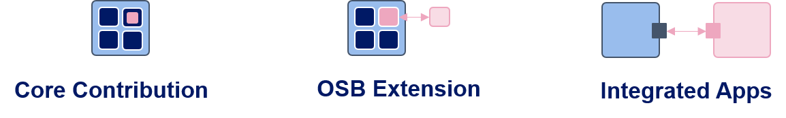

# Contribution {: class="guideH1"}

(status 2025-03-26) 
{: class="guideCreated"}

As OpenStudyBuilder adoption grows, Novo Nordisk is actively exploring a sustainable contribution model to enable broader participation in its development and maintenance. Given the complexity and scale of the project, code contributions have not yet been enabled, but with increasing interest from companies looking to implement OpenStudyBuilder, discussions are underway to define the future approach for maintaining and evolving the solution.

In the scope of OpenStudyBuilder, additional functionality could be implemented in three different ways. The "Core Contributions" are changes to the core source code of OpenStudyBuilder, currently owned, maintained, and released as open-source by Novo Nordisk. Discussions are ongoing about how the core can enable contributions and potentially include additional maintainers and owners in the future.

Then there is the option to create "OSB Extensions." These extensions look and feel as if they were core functionalities integrated into the User Interface but are actually standalone features that could be developed, maintained, and delivered by anyone using any license. The idea is to have plug-and-play functionality that can be additionally installed depending on the need, similar to existing Word Plugins that can be purchased and used.

Finally, OpenStudyBuilder can integrate with various other applications, such as EDC systems, authoring tools, or any other relevant software. These integrations could also be developed, maintained, and delivered by anyone using any license. We already see integrations for Oracle and Marvin EDC systems, as well as the Marvin ePRO tool, and we anticipate many more in the coming year.

## Extension and Integrations

As mentioned, extensions and integrations could be developed, maintained and released by anyone using any license. For integrations, we recommend using the consumer API which is meant to be stable and version controlled. Currently, the API is not covering much functionality and some integrations might need to use the internal API. Please be aware that the internal API can be changed any time.

For extensions, we recommend talking to the OpenStudyBuilder team as we currently do not have guidelines, configurations or similar to support this. This might change in the future.

## Core-Contributions

Core contributions are code changes to the core source code of OpenStudyBuilder maintained by Novo Nordisk. Details about the intended initial process is work in progress.

### CLA

To enable contributions in a legal setup, we will very likely work with contributor license agreements (CLA) for entities. More information and the CLA will be added later.

**Instructions**: When you have receided and signed the CLA, send the scanned document as mail to <a href="mailto:kjgl@novonordisk.com">kjgl@novonordisk.com</a>.

### CLA Background

When someone is the owner of source code, this entity is enabled to change the license to any other license. Without a CLA, contributions to a repository via GitHub or GitLab for example use the license of the repository. This means that for the copy-left license used in OpenStudyBuilder (GPLv3), contributions are also under the GPLv3 license. To enable the owner to change the license, a CLA is needed. The CLA is a legal document that gives the owner the right to change the license of the contributions among other rights. The CLA is a one-time process and is valid for all contributions to the repository from the entity.

**Why do we need a CLA?**

Argument | Description
--- | ---
Clarify Rights & Ownership | Ensures that the project maintainers have the necessary rights to use, modify, and distribute the contributed code.
Prevent Legal Disputes | Helps avoid future intellectual property conflicts by confirming that contributors have the right to contribute the code and are not violating any third-party rights.
Enable License Compliance | Ensures that all contributions align with the project's open-source license, avoiding potential licensing conflicts.
Protect Against Patent Claims | Some CLAs include clauses that prevent contributors from later asserting patent claims against the project based on their contributions.
Facilitate Business & Community Adoption | Provides assurance to companies and individuals that the project is legally sound, encouraging broader use and contribution.

**Project Harmony Agreements**

The [project harmony](https://www.harmonyagreements.org/){target=_blank} maintains standard contributor license agreements and assignment agreements which could be used. The following provides short overview of these two types:

Feature | License Agreement (CLA) | Assignment Agreement (CAA)
--- | --- | ---
Ownership | Contributor **retains copyright**. | Contributor **transfers copyright** to the project maintainer.
Rights Granted | The project gets a **broad license** to use, modify, and distribute the contribution. | The project maintainer becomes the **full owner** of the contribution.
Contributor Control | Contributor retains some rights, such as reusing their code elsewhere. | Contributor loses ownership but may receive a **license back** to use the contribution.
Flexibility | Easier for contributors as they keep ownership. | Gives the project stronger control over contributions.
Legal Complexity | Less complex, as it only grants a license. | More complex, as it requires a formal transfer of copyright.

## Long term vision

We envision an alliance driven maintenance of the OpenStudyBuilder core in the far future. As this is work in progress, we will share additional information and the vision when available and approved.