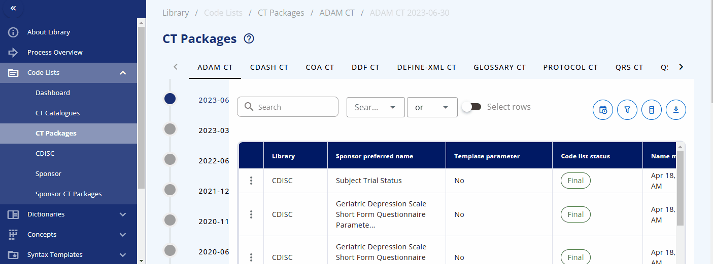
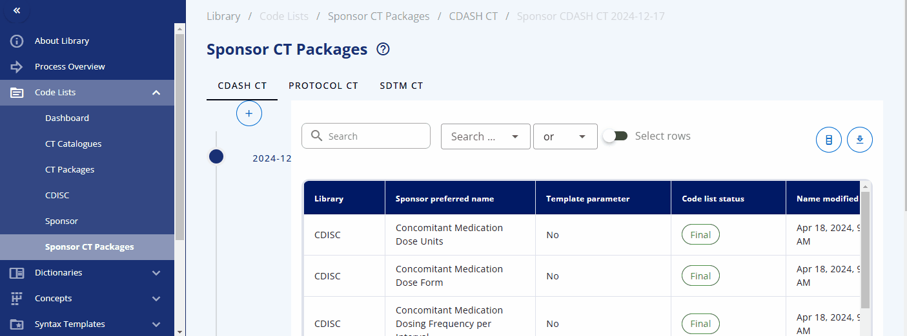
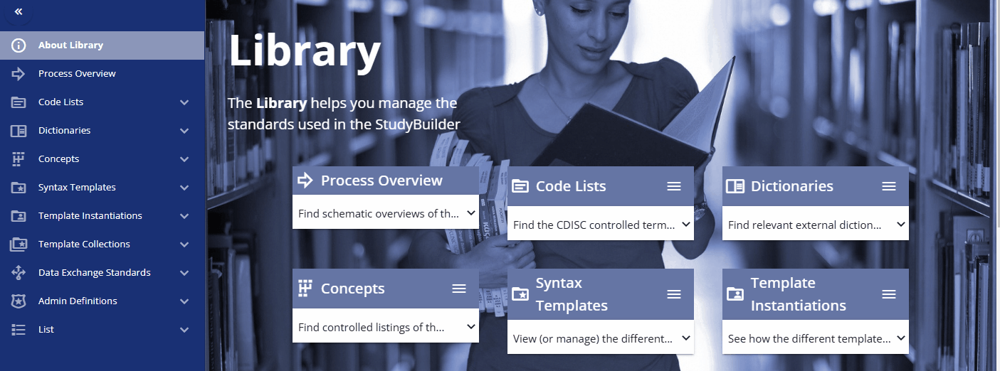
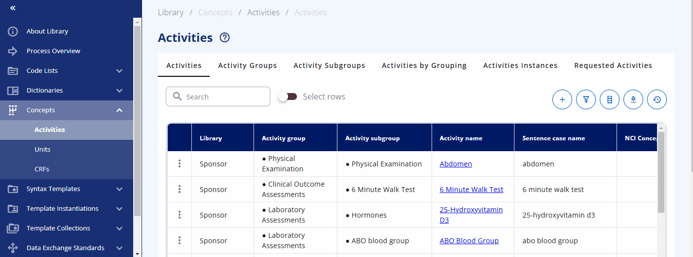

# Library Demonstration {: class="guideH1"}

(created 2025-01-20 using v0.12.1) 
{: class="guideCreated"}

The following animations and descriptions give a quick demonstration of the OpenStudyBuilder solution. A more detailed video is available on [YouTube](https://www.youtube.com/watch?v=dL5CY0BwfEs){target=_blank}.

The library is the central place to manage all your standards. This includes controlled terminology (code lists), dictionaries, concepts for activities known as Biomedical Concepts (BCs), units, and standard CRFs. You can define protocol standards using syntax templates and instances to support free text with semantic meaning, which is currently used for objectives, endpoints, time frames, criteria, and more. Additionally, you can browse data exchange standards like SDTM and create clinical programs and projects to group your studies into these categories.

## Code Lists

Codelists can be managed in the "Code Lists" section of the library. Here, you can create new codelists, browse available codelists, and search for specific ones. While it is recommended to load, create, and update codelists via scripts and the API for efficiency, you can also use the web interface to manage these tasks. This flexibility ensures that you can maintain and update your codelists in a way that best suits your workflow.

### Browsing

In the "CT Catalogues" section, you can **browse** codelists for specific standards like SDTM, ADaM, and others. You can also search for specific codelists using the search field. The table not only provides the results but also offers additional information, such as whether the codelist is from CDISC or is sponsor-specific, and their attributes, including whether they are extensible or not.

### Codelist Terms

By pressing the three dots for a codelist, you can either edit the codelist or view its **terms** and check out the history. When viewing the terms, a table is displayed showing various attributes and all associated terminology. You can also edit a term directly from this view.

Please note that each term, in addition to the CDISC standard, has the following additional attributes:

- Sponsor preferred name
- Sentence case name
- Order

You can maintain these additional values to enable alternative terminology. For example, in the "sex" codelist, where the CDISC value is "F", the sponsor preferred name "female" is assigned. This allows you to reference the CDISC terminology while using the sponsor preferred name in the protocol and the CRF item label.

### Packages & Version Changes

An overview of the **packages** and their versions is available in the "CT Packages" section. Here, you can see which packages are available in which version and browse the corresponding terms from each package.

Another valuable feature is the ability to view version changes of the packages. You can compare, for example, the SDTM changes between two specific dates and see which codelists have been added, deleted, or modified. By clicking on a changed codelist, you can view the specific changes made to the terms.

### Sponsor CT Packages

The CDISC Controlled Terminology is version-controlled and managed in packages that are regularly released and updated by CDISC. To enable version control for sponsor-specific codelists and sponsor attributes for CDISC codelists, sponsor CT packages are introduced.

A sponsor CT package is a label associated with codelists and terms for a specific time point. This allows access to traceable items, as sponsor codelists and terms can change over time. By accessing a specific sponsor CT package, you can ensure you receive the codelists and terms from that specific time point without worrying about changes that might have occurred afterwards. During the course of a study, you can update the sponsor CT package to the latest version to get the most recent codelists and terms.

A new sponsor CT package can be created under the "Sponsor CT Packages" area by selecting the plus button. You can then select the corresponding standard catalog and CDISC package version. This will create a collection of codelists with their terms for a specific version, including both CDISC and sponsor-specific codelists.

## Dictionaries

The "Dictionaries" section of the library is where you can browse and manage dictionaries. It is designed to use scripts for loading the dictionaries efficiently. At Novo Nordisk, only relevant terms from the corresponding dictionaries are loaded into the library to maintain a clean and streamlined environment, avoiding unnecessary terms. Loading dictionaries into the OpenStudyBuilder library enables linkage and downstream usage of these items, facilitating seamless integration and data consistency.

Currently, the following dictionaries are loaded into OpenStudyBuilder:

- SNOMED
- MED-RT
- UNII
- UCUM

## Activity Concepts

In OpenStudyBuilder, activity concepts are referred to as Biomedical Concepts (BCs). These concepts define activities such as laboratory tests and link them to various additional information, including their correspondence to SDTM domains, relevant protocol sections, and more.

For a comprehensive understanding of how activity concepts work, it is recommended to read the guide on activity concepts ([see here](./guide_activity_concept.md)).

Within the "Concepts" -> "Activities" section, you can browse and manage these concepts. The "Activities" section displays what is used in the protocol. Each activity can be grouped into one or multiple activity groups and sub-groups. There is also a display to see the activities within their corresponding groupings, named "Activities by Grouping". The "Activities Instances" section lists all activities as required for data specification.

You can search for a specific activity using the search bar. For example, you can find the "Albumin" activity. By clicking the link, additional information is displayed, including the groupings and sub-groupings as well as available instances. Albumin can be collected as a "Urine" or "Serum" test. By clicking on a specific instance, you can view more detailed information about that instance. In future releases, you will likely also see links to data exchange standards like SDTM and more.

You can also directly search for data specification standards in the "Activities Instances" screen. For some activities, such as diastolic blood pressure, additional information is already created and can be viewed. For example, when diastolic blood pressure is to be collected, details such as the location and laterality might also be recorded. This information is predefined in the instance already.

## Case Report Forms (CRFs)

The "CRFs" section of the library is where you can manage standard CRFs including corresponding Forms, Item Groups and Items. with "CRF Templates" a template can be generated and browsed. First, the corresponding items, item groups and forms must be created and can then be assigned to a template.

The easiest way to build a CRF is by using the CRF Tree where you can easily assign the corresponding elements to the CRF. With the "CRF View" it is possible to see specific elements and their rendering in different formats. A complete CRF template can for example be visualized as an annotated CRF and experted as an ODM.xml file (currently version 1.3) or as a PDF document.

The OpenStudyBuilder also supports extensions and alias names as supported by the CRF standard.

## Data Exchange Standards

In the "Data Exchange Standards" area, the data models as well as the implementation guide contents can be browsed. A specific version can be selected and the corresponding content is displayed.

## Admin Definition

Typically, clinical studies are grouped into projects which belong to clinical programs. 

To be continued...